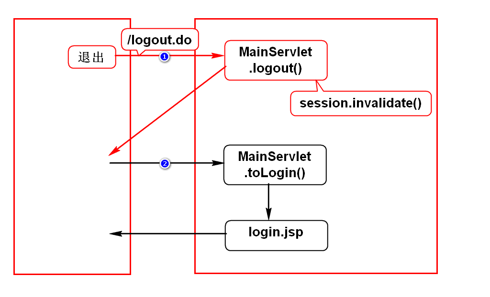
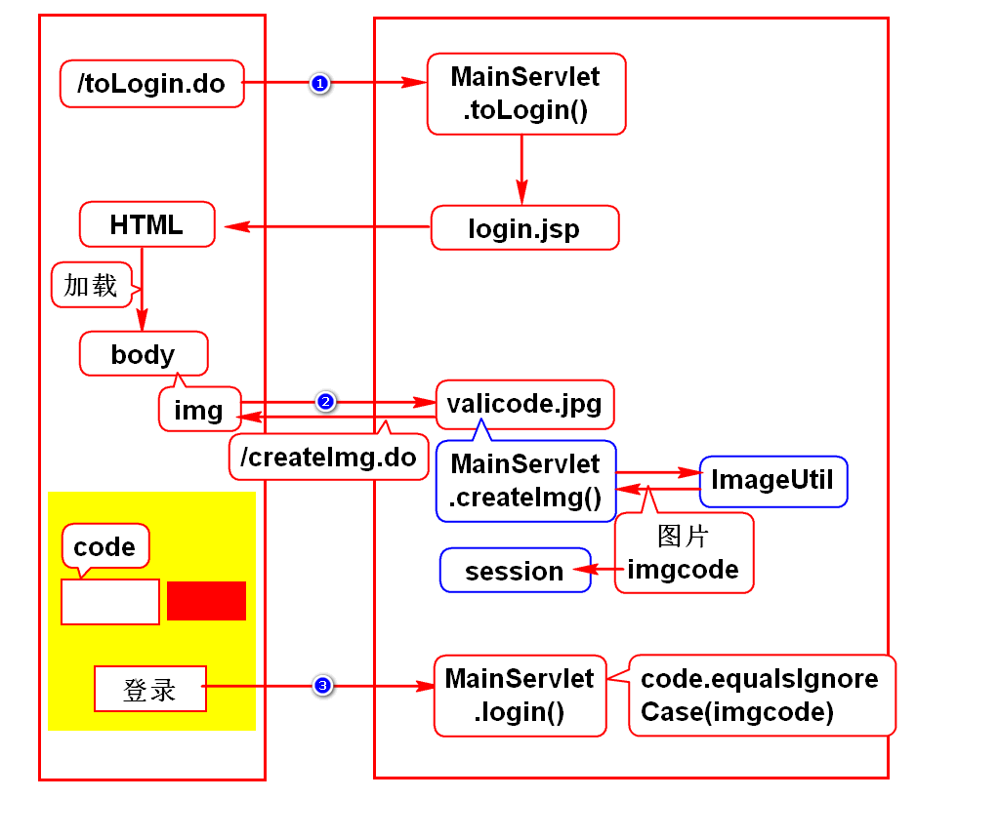
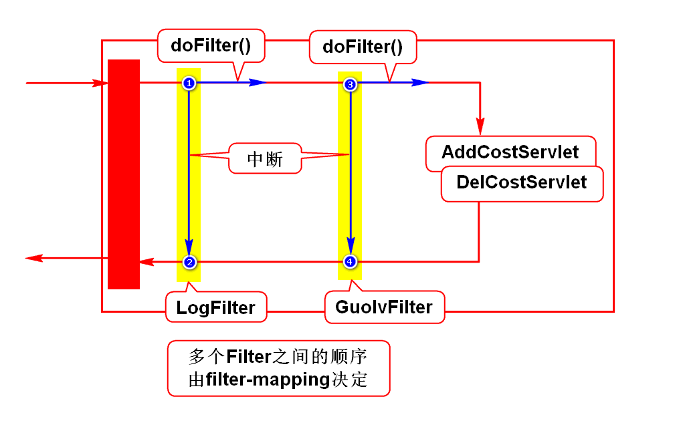
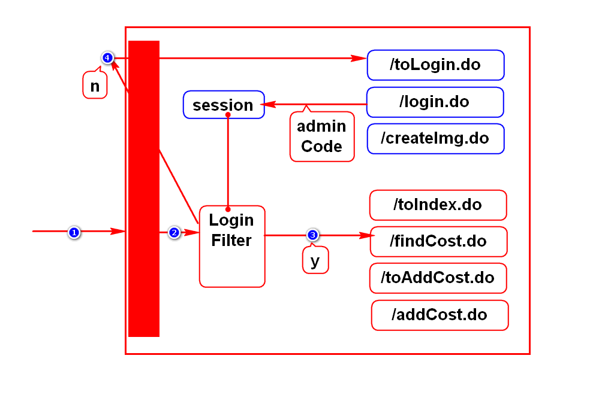
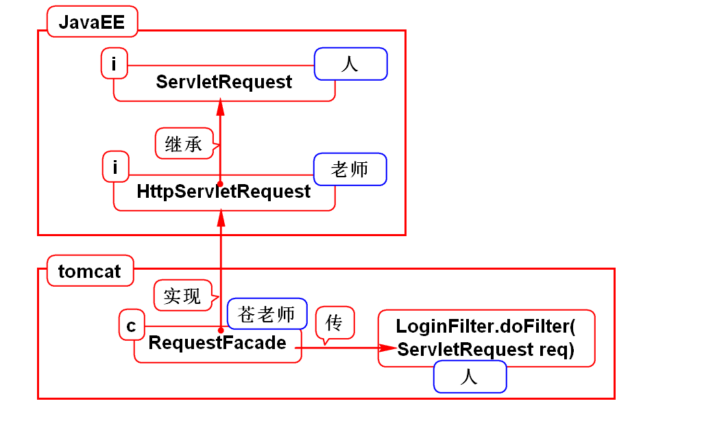

# 一.session
## 1.基本用法
- 获得session: request.getSession()
- 存数据: session.setAttribute()
- 取数据: session.getAttribute()
- 删数据: session.removeAttribute()
- 销毁: session.invalidate()

## 2.超时时间
- 默认是30分钟
- 可以在配置文件中修改此时间

## 3.cookie禁用时session怎么办?
- 解决方案: URL重写

## 4.session销毁

# 二.cookie和session理解
## 1.通俗的理解
- 它们都是暂存数据的对象,特征:
- 内部的数据可以在多个请求之间共用
- 内部的数据可以再多个组件之间共用
- 服务器会给每个浏览器创建一组cookie,一个session

## 2.专业的理解
- HTTP协议是一个无状态协议,即服务器默认不会记住浏览器
- cookie和session就是用来管理这种状态,让服务器记住浏览器的
- 即:它们都是用来进行状态管理的对象
> 状态: 用来证明浏览器曾经访问过的证据(数据)

# 三.验证码

# 四.过滤器
## 1.过滤器的作用
- 用来处理项目中的公共的业务
- 记录日志,过滤敏感词,登录检查
> 公共业务:很多请求都需要进行处理的业务

## 2.使用步骤
- 创建一个类,实现Filter接口
- 在web.xml中配置此类

## 3.小案例

## 4.登录检查

## 5.参数说明

# 五.监听器
## 1.什么是监听器
- 监听器用来监听事件,当某事件发生时,它会通知服务器
- 它监听的目标是一些对象

## 2.监听器的分类(接口)
### 1) request
- 创建与销毁:ServletRequestListener
- 数据的变化:ServletRequestAttributeListener

### 2) session
- 创建与销毁:HttpSessionListener
- 数据的变化:HttpSessionAttributeListener

### 3) context
- 创建与销毁:ServletContextListener
- 数据的变化:ServletContextAttributeListener

## 3.开发步骤
- 创建一个类,实现对应的监听器接口
- 在web.xml中声明此类