## (7)spring表达式
	注：读取bean的属性
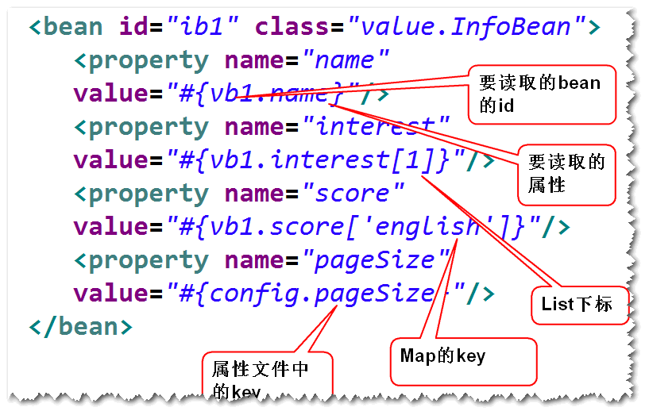

# 1. 使用注解来简化配置文件
## (1)什么是组件扫描?
	容器会扫描指定的包及其子包下面的所有的
	类，如果该类前面有特定的注解比如@Component）,
	则容器会将其纳入容器进行管理（相当于在配置文件里面
	有一个bean元素）。
## (2)如何进行组件扫描?
	step1. 在类前面添加特定的注解，比如 @Component
	注：默认的id是首字母小写之后的类名。
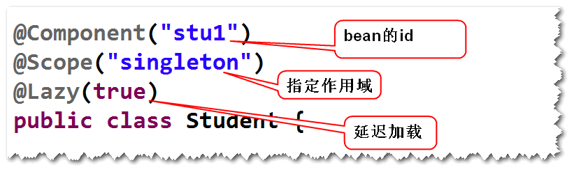
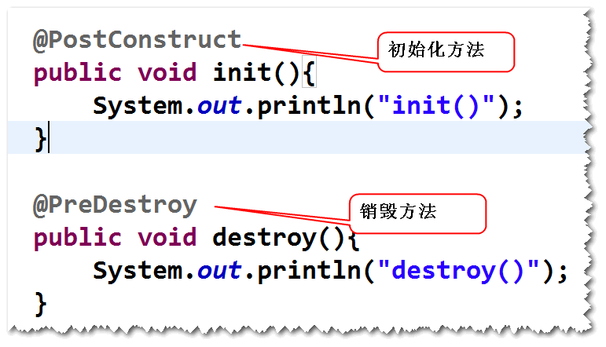

	step2. 在配置文件当中，配置组件扫描。
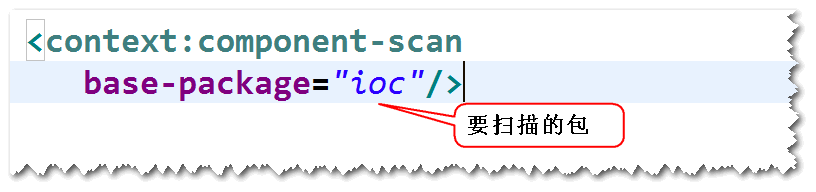
## (3)依赖注入相关的注解
	1)@Autowired @Qualifier
	注：该注解支持set方法和构造器注入。
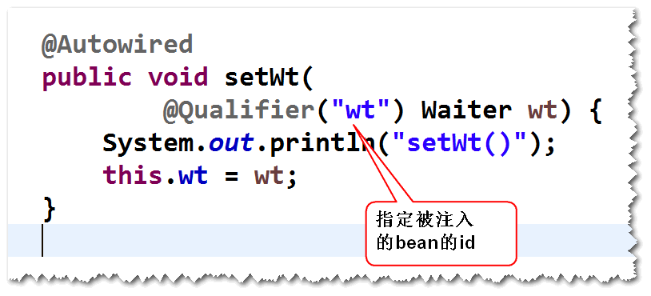
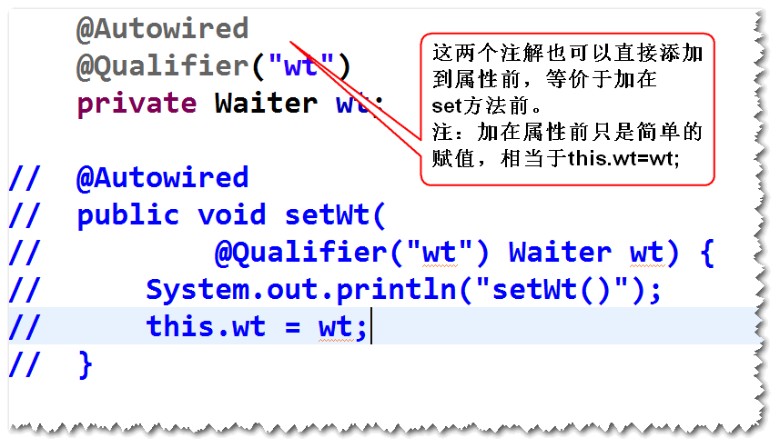

	2)@Resource
	注：该注解只支持set方法注入。
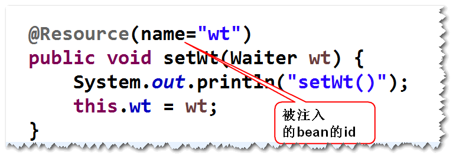
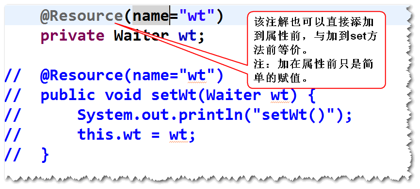

## (4)注入基本类型的值和spring表达式的值
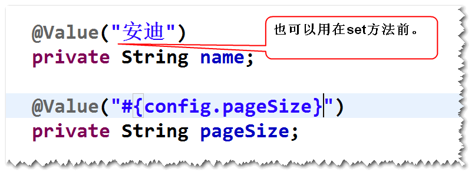

# SpringMVC
## (1)什么是SpringMVC?
	用来简化基于MVC架构的web应用程序开发的框架。
	注：SpringMVC是spring中的一个模块。
## (2)五大组件
	1)有哪五大组件?
	DispatcherServlet 前端控制器
	HandlerMapping  映射处理器
	Controller	处理器
	ModelAndView
	ViewResolver  视图解析器
	2)它们之间的关系
	a.请求发送给DispatcherServlet来处理，DispatcherServlet
	会依据HandlerMapping的配置调用对应的Controller来处理。
	b.Controller将处理结果封装成ModelAndView，然后返回给
	DispatcherServlet。
	c.DispatcherServlet会依据ViewResolver的解析调用对应的
	视图对象（比如jsp）来生成相应的页面。
	注：视图部分可以使用jsp,也可以使用其它的视图技术，比如
		freemarker,velocity等等。
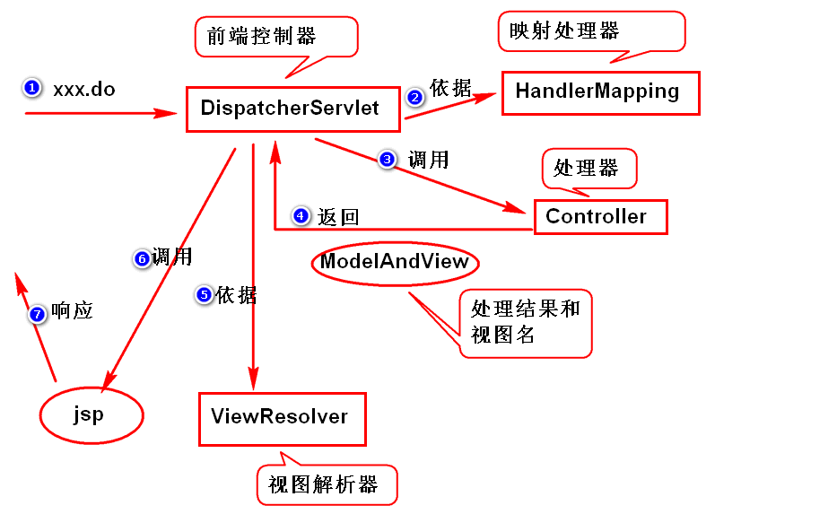

## （3）编程步骤
	step1. 导包
	spring-webmvc
	step2. 添加配置文件。
	step3. 配置DispatcherServlet。
	step4. 写Controller。
	step5. 写jsp。
	step6.在配置文件当中，添加HandlerMapping,
		ViewResolver的配置。
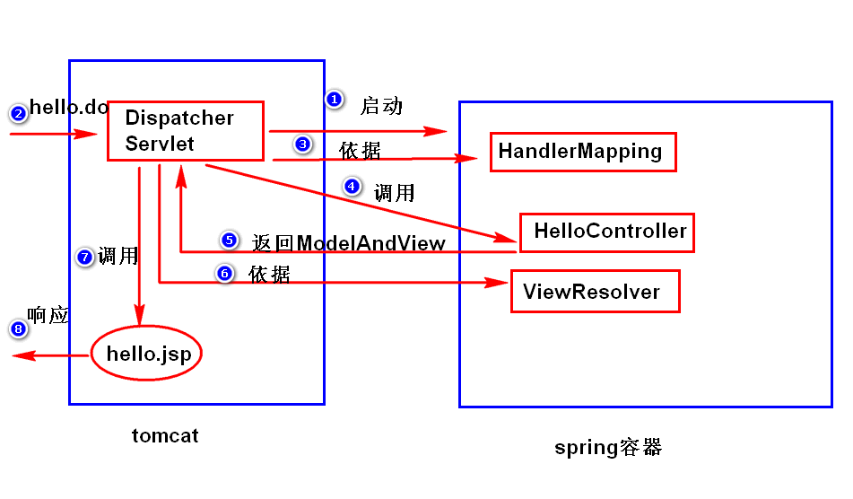

练习：
	http://localhost:8080/springmvc-lab/toLogin.do
	返回一登录页面。
	
	
	
	
	