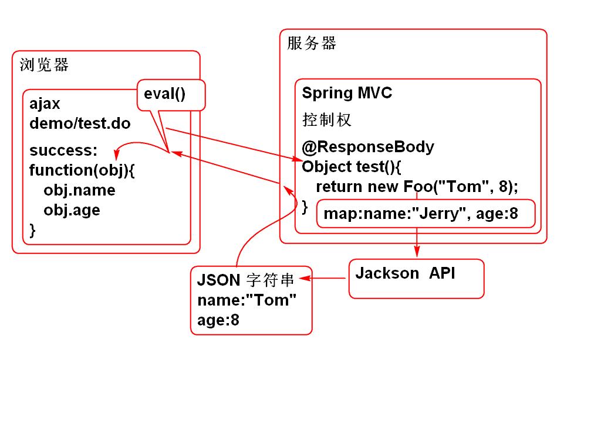
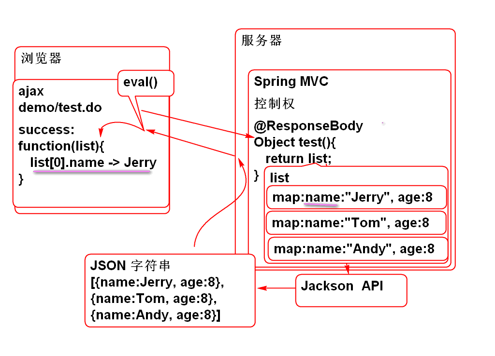
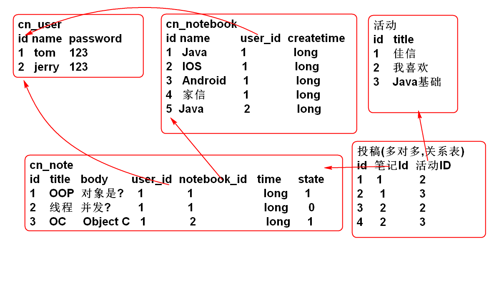
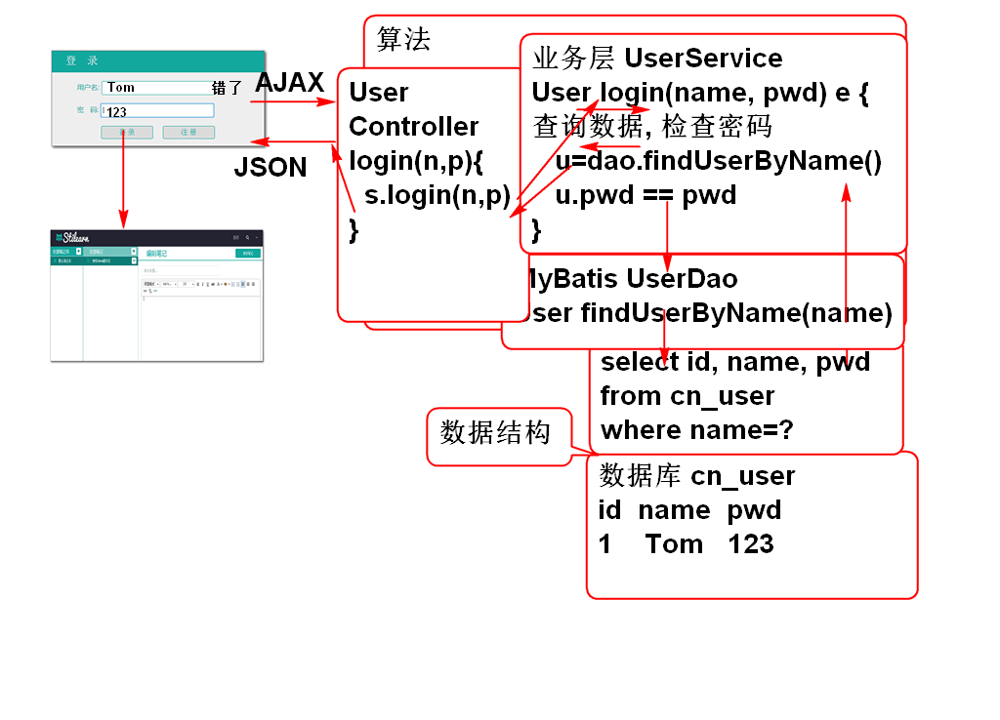

# 云笔记

## JSON 是什么

JSON 就是JS的一部分: JSON 是 JavaScript中的对象直接量语法, 用于声明JS对象.

如:
		
	var i = 5;
	var str = 'abc';
	var obj = {age:5, name:'Tom'};
	var ary = ['Tom','Jerry','Andy'];
	var list = [{name:"Tom",age:8},{name:"Jerry",age:9}];

符合JSON语法的字符串称为JSON字符串:

	var str = '{"name":"Tom","age":6}';
	var str = '["name","Tom","age"]';

如何将JSON字符串转换为JSON对象(JS对象)
	
	var obj = eval("("+str+")");

## Spring MVC 支持AJAX原理

## 需求分析

软件= 数据结构+算法

## 设计数据的存储

1. 内存:  数据临时计算存储场所, 关闭电源就消失, 称为瞬态的
	- 运行内存
	- 分配的是对象  

2. 外存: (SSD固体硬盘, HDD机械硬盘, SD, 闪存, U盘), 关闭电源不消失, 称为持久状态
	- 存储容量  
	- 保存的是文件 单机(单线程)程序可以使用文件存储数据
	- 数据库(文件) 数据库管理系统,提供了并发访问管理! 适合多线程访问

> 云笔记采用数据库存储数据!

### 设计数据的存储

ER 图:

### MySQL的简单使用

1. 使用MySQL命令行工具
	- Windows 用户使用: MySQL Client, 输入密码
	- Linux: 
	
			mysql -u用户名 -p密码
			mysql -uroot -p

2. 显示数据库命令

		show databases;

3. 创建数据库命令

		create database 数据库名;

4. 删除数据库命令

		drop database 数据库名;

5. 切换当前数据库
	
		use 数据库名
		use mysql

6. 显示当前数据库中的全部表

		show tables;

7. 建表语句, 在当前数据库中创建表

		create table 表名 (列的声明...)

8. 设置当前命令行窗口的编码: 设置当前窗口的文本编码为UTF-8

		set names utf8;

9. 执行sql脚本命令: 执行文本文件中的一批SQL命令.
	- 如果SQL文件是UTF-8编码的, 就必须先执行 	set names utf8;
	
		source 文本文件的路径名;
		source D:\Robin\Note\note_ziliao\cloud_note.sql
		source /home/soft01/note_ziliao/cloud_note.sql
		
	> 请注意: 一定要清楚路径, 保障路径的正确性!!!

案例: 执行脚本建立数据表:

	source /home/soft01/note_ziliao/cloud_note.sql
	show databases;
	use cloud_note;
	show tables;

案例: 创建一张表, 并且插入数据. 

	create database demo;
	use demo
	create table MyTable(id int, name varchar(100));
	insert into MyTable (id, name) values (1, 'Tom');
	insert into MyTable (id, name) values (2, 'Jerry');
	select id, name from MyTable;
	drop table MyTable;
	drop database demo;

## 环境搭建

1. 创建项目
	- 创建Maven项目
	- 生成web.xml
	- 导入目标运行环境:Tomcat运行环境
2. 导入要的包: pom.xml
	
		<dependency>
			<groupId>org.springframework</groupId>
			<artifactId>spring-webmvc</artifactId>
			<version>3.2.8.RELEASE</version>
		</dependency>
		<dependency>
			<groupId>com.fasterxml.jackson.core</groupId>
			<artifactId>jackson-annotations</artifactId>
			<version>2.2.3</version>
		</dependency>
		<dependency>
			<groupId>com.fasterxml.jackson.core</groupId>
			<artifactId>jackson-core</artifactId>
			<version>2.2.3</version>
		</dependency>
		<dependency>
			<groupId>com.fasterxml.jackson.core</groupId>
			<artifactId>jackson-databind</artifactId>
			<version>2.2.3</version>
		</dependency>

		<dependency>
			<groupId>org.mybatis</groupId>
			<artifactId>mybatis</artifactId>
			<version>3.2.8</version>
		</dependency>
		<dependency>
			<groupId>org.mybatis</groupId>
			<artifactId>mybatis-spring</artifactId>
			<version>1.2.3</version>
		</dependency>
		<dependency>
			<groupId>org.springframework</groupId>
			<artifactId>spring-jdbc</artifactId>
			<version>3.2.8.RELEASE</version>
		</dependency>
		<dependency>
			<groupId>commons-dbcp</groupId>
			<artifactId>commons-dbcp</artifactId>
			<version>1.4</version>
		</dependency>

		<dependency>
			<groupId>junit</groupId>
			<artifactId>junit</artifactId>
			<version>4.12</version>
		</dependency>

		<dependency>
			<groupId>mysql</groupId>
			<artifactId>mysql-connector-java</artifactId>
			<version>5.1.6</version>
		</dependency>

3. 配置Spring MVC控制器: web.xml

		  <servlet>
		    <description></description>
		    <display-name>DispatcherServlet</display-name>
		    <servlet-name>DispatcherServlet</servlet-name>
		    <servlet-class>org.springframework.web.servlet.DispatcherServlet</servlet-class>
		    <init-param>
		      <description></description>
		      <param-name>contextConfigLocation</param-name>
		      <param-value>classpath:conf/spring-*.xml</param-value>
		    </init-param>
		    <load-on-startup>1</load-on-startup>
		  </servlet>
		  <servlet-mapping>
		    <servlet-name>DispatcherServlet</servlet-name>
		    <url-pattern>*.do</url-pattern>
		  </servlet-mapping>

4. 添加Spring-MVC 配置文件: conf/spring-mvc.xml

		<!-- 配置组件扫描 -->
		<context:component-scan 
			base-package="cn.tedu.note.controller"/>
		<!-- 配置MVC注解扫描 -->
		<mvc:annotation-driven />

5. 添加数据库连接参数文件: conf/jdbc.properties:

		driver=com.mysql.jdbc.Driver
		url=jdbc:mysql://localhost:3306/cloud_note
		user=root
		password=root
		maxActive=20 

6. 配置MyBatis: conf/spring-mybatis.xml
	
		<!-- 配置 spring-mybatis.xml -->
		<!-- 读取配置文件 -->
		<util:properties id="jdbc"
			location="classpath:conf/jdbc.properties"/> 
		
		<!-- 配置数据库连接池 -->
		<bean id="dataSource"
			class="org.apache.commons.dbcp.BasicDataSource"
			destroy-method="close"> 
			<property name="driverClassName"
				value="#{jdbc.driver}"/>
			<property name="url"
				value="#{jdbc.url}"/>
			<property name="username"
				value="#{jdbc.user}"/>
			<property name="password"
				value="#{jdbc.password}"/>
			<property name="maxActive"
				value="#{jdbc.maxActive}"></property>
		</bean>
		
		<!-- 配置MyBatis的 SessionFactory -->
		<bean id="sqlSessionFactory"
			class="org.mybatis.spring.SqlSessionFactoryBean">
			<property name="dataSource"
				 ref="dataSource"/>
			
			<property name="mapperLocations"
				value="classpath:mapper/*.xml"/>
	
		</bean>
		<!-- Mapper接口组件扫描 -->
		<bean class="org.mybatis.spring.mapper.MapperScannerConfigurer">
			<property name="basePackage" 
				value="cn.tedu.note.dao"/>
		</bean>

## 登录功能

程序 = 数据结构 + 算法

编程思路:

0. 搞清楚业务需求.
1. 考虑数据如何存储.
2. 如何操作数据才能达到业务目的
	- 设计SQL
3. 编程: 将业务功能和数据操作整合起来, 如何编程才能执行SQL操作数据

### 1. 数据持久层开发

1. 添加UserDao接口:

		public interface UserDao {
			
			User findUserByName(String name);
		
		}
			
2. 添加实体类 User

		public class User implements Serializable{
			private static final long 
				serialVersionUID = -288301177049569372L;
			
			private String id;
			private String name;
			private String password;
			private String token;
			private String nick;
			
			public User() {
			}
		
			public User(String id, String name, String password, String token, String nick) {
				super();
				this.id = id;
				this.name = name;
				this.password = password;
				this.token = token;
				this.nick = nick;
			}
		
			public String getId() {
				return id;
			}
		
			public void setId(String id) {
				this.id = id;
			}
		
			public String getName() {
				return name;
			}
		
			public void setName(String name) {
				this.name = name;
			}
		
			public String getPassword() {
				return password;
			}
		
			public void setPassword(String password) {
				this.password = password;
			}
		
			public String getToken() {
				return token;
			}
		
			public void setToken(String token) {
				this.token = token;
			}
		
			public String getNick() {
				return nick;
			}
		
			public void setNick(String nick) {
				this.nick = nick;
			}
		
			@Override
			public String toString() {
				return "User [id=" + id + ", name=" + name + ", password=" + password + ", token=" + token + ", nick=" + nick
						+ "]";
			}
		
			@Override
			public int hashCode() {
				final int prime = 31;
				int result = 1;
				result = prime * result + ((id == null) ? 0 : id.hashCode());
				return result;
			}
		
			@Override
			public boolean equals(Object obj) {
				if (this == obj)
					return true;
				if (obj == null)
					return false;
				if (getClass() != obj.getClass())
					return false;
				User other = (User) obj;
				if (id == null) {
					if (other.id != null)
						return false;
				} else if (!id.equals(other.id))
					return false;
				return true;
			}
		}
		
		
3. 添加SQL: mapper/UserMapper.xml:

		<mapper namespace="cn.tedu.note.dao.UserDao">
			
			<select id="findUserByName" 
				parameterType="string"
				resultType="cn.tedu.note.entity.User">
				select 
					cn_user_id as id,
					cn_user_name as name,
					cn_user_password as password,
					cn_user_token as token,
					cn_user_nick as nick
				from
					cn_user		
				where
					cn_user_name = #{name}
			</select>
			
		</mapper>

4. 测试 UserDaoTest:

		public class UserDaoTest {
			
			ClassPathXmlApplicationContext ctx;
			@Before 
			public void initCtx(){
				ctx = new ClassPathXmlApplicationContext(
						"conf/spring-mvc.xml",
						"conf/spring-mybatis.xml");
			}
		
			@After
			public void closeCtx(){
				ctx.close();
			}
			
			@Test
			public void testFindUserByName(){
				String name = "demo";
				UserDao dao = ctx.getBean(
					"userDao", UserDao.class);
				User user = dao.findUserByName(name);
				System.out.println(user); 
			}
		}
		
5. Good Luck!

-------------------

## 作业

1. 重新搭建开发环境
2. 开发登录功能持久层

 

