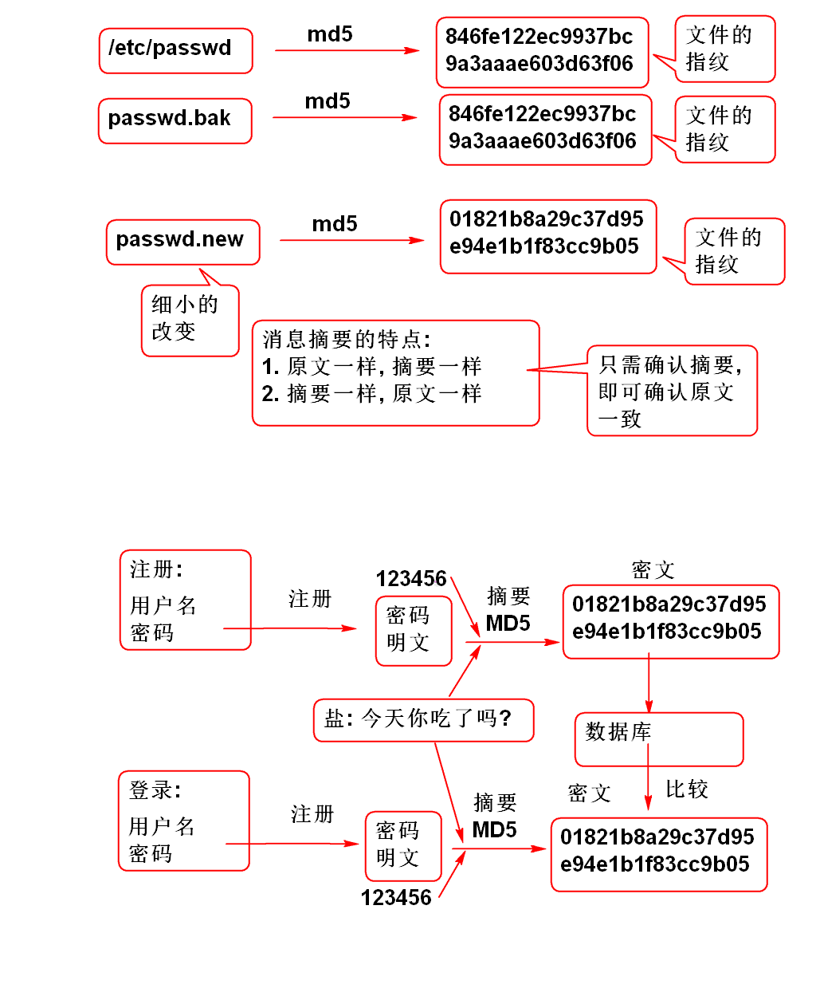
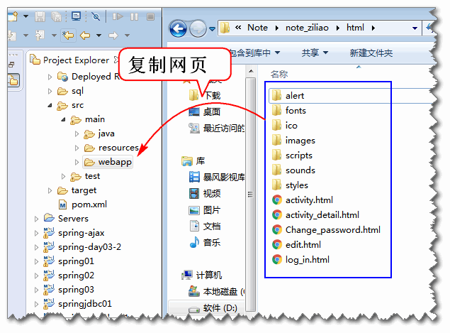

# 云笔记

## 登录(续)

### 2. 业务层

1. 创建业务层接口

		public interface UserService {
			/**
			 * 登录功能, 登录成功返回用户信息, 登录失败
			 * 则抛出异常.
			 * @param name 用户名 
			 * @param password 密码
			 * @return 如果登录成功就返回登录用户信息
			 * @throws UserNotFoundException 用户不存在
			 * @throws PasswordException 密码错误
			 */
			User login(String name, String password)
				throws UserNotFoundException,
				PasswordException;
		}

2. 创建业务异常类

		public class UserNotFoundException extends RuntimeException {
			private static final long serialVersionUID = 4180191103842028379L;
		
			public UserNotFoundException() {
			}
		
			public UserNotFoundException(String message) {
				super(message);
			}
		
			public UserNotFoundException(Throwable cause) {
				super(cause);
			}
		
			public UserNotFoundException(String message, Throwable cause) {
				super(message, cause);
			}
		
			public UserNotFoundException(String message, Throwable cause, boolean enableSuppression,
					boolean writableStackTrace) {
				super(message, cause, enableSuppression, writableStackTrace);
			}
		
		}
		
		
		public class PasswordException extends RuntimeException {
			private static final long serialVersionUID = 7097581917306952312L;
		
			public PasswordException() {
			}
		
			public PasswordException(String message) {
				super(message);
			}
		
			public PasswordException(Throwable cause) {
				super(cause);
			}
		
			public PasswordException(String message, Throwable cause) {
				super(message, cause);
			}
		
			public PasswordException(String message, Throwable cause, boolean enableSuppression, boolean writableStackTrace) {
				super(message, cause, enableSuppression, writableStackTrace);
			}
		
		}

3. 实现业务层方法 

		@Service("userService")
		public class UserServiceImpl 
			implements UserService {
			
			@Resource
			private UserDao userDao;
			
			public User login(String name, String password) 
					throws UserNotFoundException, 
					PasswordException {
				if(password==null ||
						password.trim().isEmpty()){
					throw new PasswordException("密码空");
				}
				if(name==null || name.trim().isEmpty()){
					throw new UserNotFoundException("用户名空");
				}
				User user = userDao.findUserByName(
						name.trim());
				if(user==null){
					throw new UserNotFoundException("name错误");
				}
				if(password.trim().equals(user.getPassword())){
					return user;
				}
				throw new PasswordException("密码错误");
			}
		}

4. 配置Spring, 扫描业务层组件的注解 conf/spring-service.xml:

		<context:component-scan  base-package="cn.tedu.note.service"/>

5. 测试	
	- 定义测试基类, 封装Spring容器初始化功能:

			public abstract class BaseTest {
			
				protected ClassPathXmlApplicationContext ctx;
			
				@Before
				public void initCtx() {
					ctx = new ClassPathXmlApplicationContext(
							"conf/spring-mvc.xml",
							"conf/spring-mybatis.xml",
							"conf/spring-service.xml");
				}
			
				@After
				public void close() {
					ctx.close();
				}
			
			}

	- 测试登录方法
	
			public class UserServiceTest {
				@Test
				public void testLogin(){
					String name = "demo";
					String password = "123456";
					UserService service = 
						ctx.getBean("userService",
						UserService.class);
					User user = service.login(
						name, password);
					System.out.println(user); 
				}
			}

	> 为了测试, 需要更像数据库, 更新数据库的SQL
	
		use cloud_note;
		
		update cn_user 
		set cn_user_password='123456' 
		where cn_user_name='demo';
		
		select cn_user_password 
		from cn_user 
		where cn_user_name='demo';

### 3. 密码的加密处理

利用消息摘要技术加密用户密码, 避免保存密码明文, 可以有效的提供系统的安全性. 其原理如下:

加密算法测试:

	public class Md5Test {
		
		@Test
		public void testMd5(){
			String str = "123456";
			String md5 = DigestUtils.md5Hex(str);
			System.out.println(md5); 
			//e10adc3949ba59abbe56e057f20f883e
			//加盐摘要
			String salt = "今天你吃了吗?";
			md5 = DigestUtils.md5Hex(salt+str);
			System.out.println(md5); 
			//8bbf37d0962bf915a780f410ec1a4741
			// update cn_user 
			// set cn_user_password='8bbf37d0962bf915a780f410ec1a4741'
			// where cn_user_name='demo';
			
		}
	}

实现密码加密验证功能:

1. 导入消息摘要工具类: 
		
		<dependency>
		  <groupId>commons-codec</groupId>
		  <artifactId>commons-codec</artifactId>
		  <version>1.10</version>
		</dependency>		
				
2. 重构登录逻辑 验证摘要密码: UserServiceImpl

		public User login(String name, String password) 
				throws UserNotFoundException, 
				PasswordException {
			if(password==null ||
					password.trim().isEmpty()){
				throw new PasswordException("密码空");
			}
			if(name==null || name.trim().isEmpty()){
				throw new UserNotFoundException("用户名空");
			}
			User user = userDao.findUserByName(
					name.trim());
			if(user==null){
				throw new UserNotFoundException("name错误");
			}
			String salt="今天你吃了吗?";
			String pwd = DigestUtils.md5Hex(
					salt+password.trim());
			if(pwd.equals(user.getPassword())){
				return user;
			}
			throw new PasswordException("密码错误");
		}

3. 更新数据库, 将测试用户的密码更新为加密的 123456
		
		update cn_user
		set cn_user_password='8bbf37d0962bf915a780f410ec1a4741'
		where cn_user_name='demo';

4. 测试:

		@Test
		public void testLogin(){
			String name = "demo";
			String password = "123456";
			UserService service = 
				ctx.getBean("userService",
				UserService.class);
			User user = service.login(
				name, password);
			System.out.println(user); 
		}

### 4. 实现控制器

1. 编写 JsonResult 封装JSON返回值:

		public class JsonResult implements Serializable{
			
			public static final int SUCCESS = 0;
			public static final int ERROR = 1;
			
			private int state;
			/** 错误消息  */
			private String message;
			/** 返回正确时候的数据 */
			private Object data;
		
			public JsonResult() {
			}
			
			public JsonResult(Object data){
				state = SUCCESS;
				this.data = data;
			}
			
			public JsonResult(Throwable e) {
				state = ERROR;
				message = e.getMessage();
			}
			
			public int getState() {
				return state;
			}
		
			public void setState(int state) {
				this.state = state;
			}
		
			public String getMessage() {
				return message;
			}
		
			public void setMessage(String message) {
				this.message = message;
			}
		
			public Object getData() {
				return data;
			}
		
			public void setData(Object data) {
				this.data = data;
			}
		
			@Override
			public String toString() {
				return "JsonResult [state=" + state + ", message=" + message + ", data=" + data + "]";
			}
			
		}

2. 实现控制器: UserController

		@Controller
		@RequestMapping("/user")
		public class UserController {
		
			@Resource
			private UserService userService;
			
			@RequestMapping("/login.do")
			@ResponseBody
			public Object login(
					String name, String password){
				
				User user = userService.login(
					name, password);
				return new JsonResult(user);
				
			}
			
			/**
			 * 在其他控制器方法执行出现异常时候, 执行
			 * 异常处理方法 handleException
			 */
			@ExceptionHandler(Exception.class)
			@ResponseBody
			public Object handleException(
					Exception e){
				e.printStackTrace();
				return new JsonResult(e);
			}
		}

	> 其中 @ExceptionHandler 注解用于异常处理

3. 测试:

		http://localhost:8080/note/user/login.do?name=demo&password=123456

		http://localhost:8080/note/user/login.do

		http://localhost:8080/note/user/login.do?name=demo&password=123

	> 全面测试正常和异常情况.

### 5. 表现层脚本

1. 将html页面复制到 webapp 文件夹:

	

2. 更新log_in.html 添加脚本:

		<meta charset="utf-8"> 
		<link rel="stylesheet" href="styles/login.css"/>
		
		
			
		

3. 添加scripts/login.js文件

4. 在login.js文件添加事绑定脚本:
		
		$(function(){
			//console.log('Hello World!');
			$('#login').click(loginAction);
			$('#count').blur(checkName);
			$('#password').blur(checkPassword);
		});

5. 添加用户名和密码检查方法:

		function checkName(){
			var name = $('#count').val();
			var rule = /^\w{4,10}$/;
			if(! rule.test(name)){
				$('#count').next().html('4~10个字符');
				return false;
			}
			$('#count').next().empty();
			return true;
		}
		
		function checkPassword(){
			var password = $('#password').val();
			var rule = /^\w{4,10}$/;
			if(! rule.test(password)){
				$('#password').next().html('4~10个字符');
				return false;
			}
			$('#password').next().empty();
			return true;
		}

6. 添加登录按钮事件处理方法:

		function loginAction(){
			//console.log("loginAction");
			//获取用户输入的用户名和密码
			var name = $('#count').val();
			var password = $('#password').val();
			
			//检查 用户名和密码输入框
			var n=checkName()+checkPassword();
			if(n!=2){
				return;
			}
			
			//data 对象中的属性名要与服务器控制器的参数
			// 名一致! login(name, password)
			var data = {"name":name, 
						"password":password};
			$.ajax({
				url:'user/login.do',
				data:data,
				type:'post',
				dataType:'json',
				success: function(result){
					console.log(result);
					if(result.state==0){
						//登录成功!
						var user = result.data;
						console.log(user);
						//跳转到 edit.html
						location.href='edit.html';
					}else{
						var msg = result.message;
						$('#count').next().html(msg);
					}
				},
				error: function(e){
					alert("通信失败!");
				}
			});
		}

7. 测试, Good Luck!

-----------------

## 作业

1. 完成登录功能
2. 重新实现登录功能

