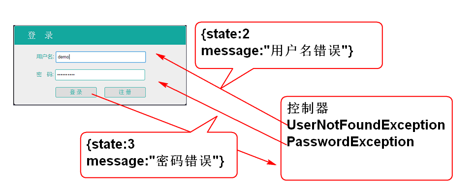
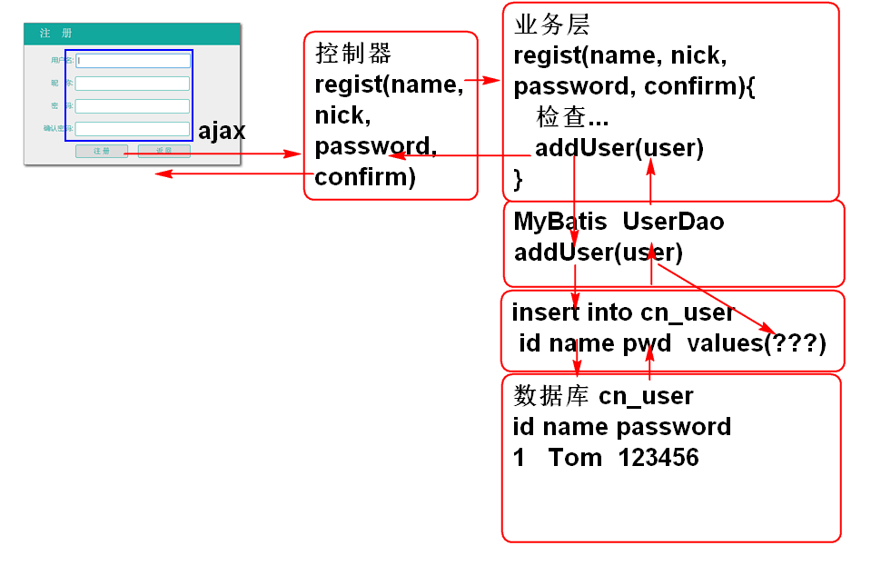
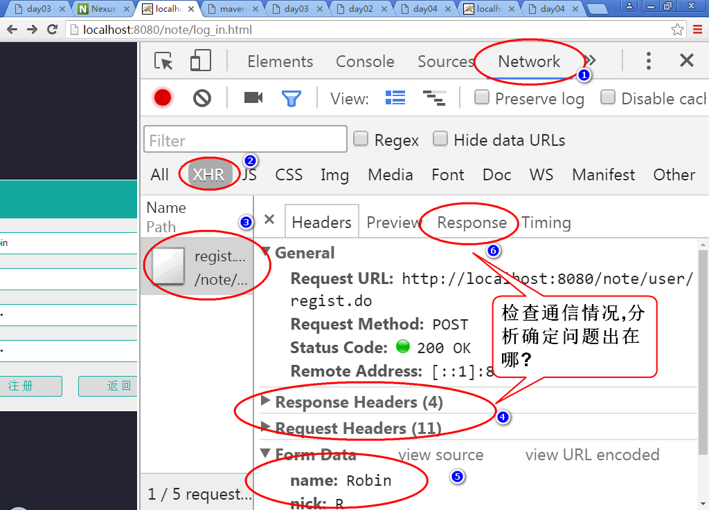
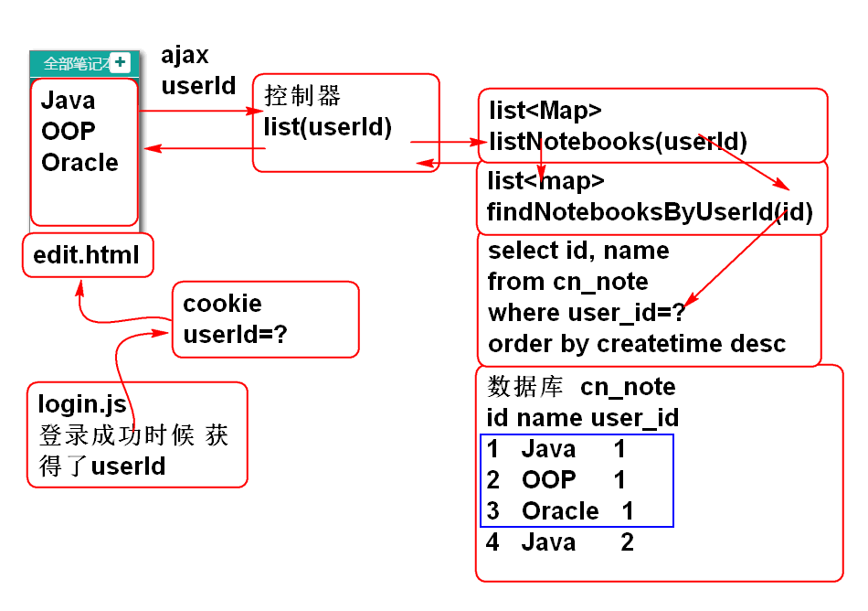
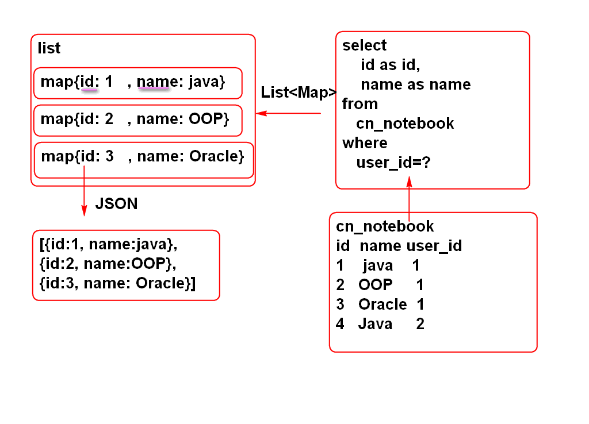

# 云笔记

## 登录(续)

### 显示错误消息

原理:

1. 重构控制器增加异常处理方法 UserController

		@ExceptionHandler( UserNotFoundException.class)
		@ResponseBody
		public JsonResult handleUserNotFound(
				UserNotFoundException e){
			e.printStackTrace();
			return new JsonResult(2,e);
		}
		
		@ExceptionHandler(PasswordException.class)
		@ResponseBody
		public JsonResult handlePassword(
				PasswordException e){
			e.printStackTrace();
			return new JsonResult(3,e);
		}

2. 重构JsonResult 添加 构造器
	
		public JsonResult(int state, Throwable e) {
			this.state = state;
			this.message = e.getMessage();
		}

3. 重构 login.js 的loginAction方法, 显示错误信息

		var msg = result.message;
		if(result.state==2){
			$('#count').next().html(msg);
		}else if(result.state==3){
			$('#password').next().html(msg);
		}else{
			alert(msg);
		}

4. 测试

## 注册功能

原理:

### 1. 持久层

1. 声明持久层方法: UserDao

		int addUser(User user);

2. 声明SQL UserMappeer.xml

		<insert id="addUser"
			parameterType="cn.tedu.note.entity.User">
			insert into cn_user (
				cn_user_id,
				cn_user_name,
				cn_user_password,
				cn_user_token,
				cn_user_nick
			) values (
				#{id},
				#{name},
				#{password},
				#{token},	
				#{nick}
			)
		</insert>

3. 测试 UserDaoTest:
	
		UserDao dao;
		@Before
		public void initDao(){
			dao = ctx.getBean(
					"userDao", UserDao.class);
		}
		@Test
		public void testAddUser(){
			String id=UUID.randomUUID().toString();
			String name = "Tom";
			String salt = "今天你吃了吗?";
			String password = 
				DigestUtils.md5Hex(salt+"123456");
			String token = "";
			String nick = "";
			User user = new User(
				id, name, password, token, nick);
			int n = dao.addUser(user);
			System.out.println(n); 
		}

### 2. 业务层

1. 声明业务层方法 UserService

		/**
		 * UserService 中添加注册功能
		 * @param name 
		 * @param nick
		 * @param password
		 * @param confirm
		 * @return 注册成功的用户信息
		 * @throws UserNameException 用户名异常
		 * @throws PasswordException 密码异常
		 */
		User regist(String name, String nick, 
				String password, String confirm)
			throws UserNameException, 
			PasswordException;

2. 声明业务层异常 UserNameException
		
		public class UserNameException extends RuntimeException {
			private static final long serialVersionUID = 6435296194529486206L;
		
			public UserNameException() {
			}
		
			public UserNameException(String message) {
				super(message);
			}
		
			public UserNameException(Throwable cause) {
				super(cause);
			}
		
			public UserNameException(String message, Throwable cause) {
				super(message, cause);
			}
		
			public UserNameException(String message, Throwable cause, boolean enableSuppression, boolean writableStackTrace) {
				super(message, cause, enableSuppression, writableStackTrace);
			}
		
		}

3. 重构 jdbc.properties 和 UserServiceImpl, 将salt存储到配置文件, 利用Spring注入到属性中:
	
		# jdbc.properties
		salt=\u4ECA\u5929\u4F60\u5403\u4E86\u5417?

		//	UserServiceImpl
		@Value("#{jdbc.salt}")
		private String salt;

4. 实现业务层方法: UserServiceImpl

		public User regist(String name, 
				String nick, String password, 
				String confirm)
				throws UserNameException, PasswordException {
			//检查name, 不能重复
			if(name==null || name.trim().isEmpty()){
				throw new UserNameException("不能空");
			}
			User one = userDao.findUserByName(name);
			if(one!=null){
				throw new UserNameException("已注册");
			}
			//检查密码
			if(password==null || password.trim().isEmpty()){
				throw new PasswordException("不能空");
			}
			if(! password.equals(confirm)){
				throw new PasswordException("确认密码不一致");
			}
			//检查nick
			if(nick ==null || nick.trim().isEmpty()){
				nick = name;
			}
			String id = UUID.randomUUID().toString();
			String token = "";
	 
			password = DigestUtils.md5Hex(salt+password);
			User user = new User(
					id, name, password, 
					token, nick);
			int n = userDao.addUser(user);
			if(n!=1){
				throw new RuntimeException("添加失败!");
			}
			return user;
		}

5. 测试:UserServiceTest

		UserService service;
		@Before
		public void initService(){
			service = ctx.getBean("userService",
					UserService.class);
		}
		
		@Test
		public void testRegist(){
			User user = service.regist(
					"Andy", "Andy", "123456", 
					"123456");
			System.out.println(user); 
		}
		
### 3. 控制器 

1. 添加控制器方法 UserController

		@RequestMapping("/regist.do")
		@ResponseBody
		public JsonResult regist(String name,
				String nick, String password,
				String confirm){
			User user = userService.regist(
					name, nick, password, confirm);
			return new JsonResult(user);
		}

2. 测试

		http://localhost:8080/note/user/regist.do?name=Jerry&nick=AN&password=12345&confirm=12345

### 4. 添加注册JS脚本

1. 更新 log_in.html 取消页面检查js脚本:

		window.onload=function(){
			var t =setTimeout("get('zc').style.visibility='visible'",800);
			//get('final_password').onblur=function(){
			//	var npassword=get('regist_password').value;
			//	var fpassword=get('final_password').value;
			//	if(npassword!=fpassword){
			//		get('warning_3').style.display='block';
			//	}
			//}
			//get('regist_password').onblur=function(){
			//	var npassword=get('regist_password').value.length;
			//	if(npassword<6&&npassword>0){
			//		get('warning_2').style.display='block';
			//	}
			//}
			//get('regist_password').onfocus=function(){
			//	get('warning_2').style.display='none';
			//}
			//get('final_password').onfocus=function(){
			//	get('warning_3').style.display='none';
			//}
		}

2. 添加注册对话框事件脚本 login.js 

		$('#regist_button').click(registAction);
		$('#regist_username').blur(checkRegistName);
		$('#regist_password').blur(checkRegistPassword);
		$('#final_password').blur(checkConfirm);

3. 添加注册对话框数据检验方法:login.js 
		
		function checkConfirm(){
			var pwd2 = $('#final_password').val();
			var pwd = $('#regist_password').val();
			//pwd 如果是空值表示 false, 非空则是true
			if(pwd && pwd==pwd2){
				$('#final_password').next().hide();
				return true;
			}
			$('#final_password').next().show()
				.find('span').html('确认密码不一致');
			return false;
		}
		
		function checkRegistPassword(){
			var pwd = $('#regist_password').val().trim();
			var rule = /^\w{4,10}$/;
			if(rule.test(pwd)){
				$('#regist_password').next().hide();
				return true;
			}
			$('#regist_password').next().show()
				.find('span').html('4~10个字符');
			return false;
		}
		
		function checkRegistName(){
			var name = $('#regist_username').val().trim();
			var rule = /^\w{4,10}$/;
			if(rule.test(name)){
				$('#regist_username').next().hide();
				return true;
			}
			$('#regist_username').next().show()
			  .find('span').html('4~10字符');
			return false;
		}

4. 添加注册对话框注册按钮事件方法 login.js 

		function registAction(){
			console.log('registAction');
			//检验界面参数
			var n = checkRegistName() +
				checkRegistPassword() +
				checkConfirm();
			if(n!=3){
				return ;
			}
			//获取界面中表单数据
			var name = $('#regist_username').val().trim();
			var nick = $('#nickname').val();
			var password = $('#regist_password').val();
			var confirm = $('#final_password').val();
			//发起AJAX请求
			var url = 'user/regist.do';
			var data = {name:name, 
					nick:nick, 
					password:password, 
					confirm:confirm};
			//console.log(data);
			// $.post 是 $.ajax的简化版
			$.post(url, data, function(result){
				console.log(result);
				if(result.state==0){
					//退回登录界面
					$('#back').click();
					var name = result.data.name;
					$('#count').val(name);
					$('#password').focus();
					//清空表单
					$('#regist_username').val('');
					$('#nickname').val('');
					$('#regist_password').val('');
					$('#final_password').val('');
					
				}else if(result.state==4){
					$('#regist_username').next().show()
					  .find('span').html(result.message);
				}else if(result.state==3){
					$('#regist_password').next().show()
					  .find('span').html(result.message);
				}else{
					alert(result.message);
				}
			});
			//得到响应以后, 更新界面
		}
			
5. 重构控制器UserController 增加事件处理方法:

		@ExceptionHandler(UserNameException.class)
		@ResponseBody
		public JsonResult handleUserName(
				UserNameException e){
			e.printStackTrace();
			return new JsonResult(4,e);
		}

6. 测试...

	> 调试工具:

	

## 笔记本列表功能

原理:

### 1. 持久层

1. 添加持久层接口 NotebookDao:

		public interface NotebookDao {
		
			List<Map<String, Object>>
				findNotebooksByUserId(
				String userId);
		}

2. 添加Mapper文件: NotebookMapper.xml

		<mapper namespace="cn.tedu.note.dao.NotebookDao">
			
			<select id="findNotebooksByUserId"
				parameterType="string"
				resultType="map">
				select 
					cn_notebook_id as id,
					cn_notebook_name as name
				from 
					cn_notebook
				where
					cn_user_id = #{userId}
				order by
					cn_notebook_createtime desc
			</select>
			
		</mapper>

3. 测试:

		public class NotebookDaoTest extends BaseTest{
			
			NotebookDao dao;
			
			@Before
			public void initDao(){
				dao = ctx.getBean("notebookDao",
						NotebookDao.class);
			}
			
			@Test
			//select cn_user_id from cn_notebook;
			public void testFindNotebooksByUserId(){
				String userId="52f9b276-38ee-447f-a3aa-0d54e7a736e4";
				List<Map<String, Object>> list=
					dao.findNotebooksByUserId(userId);
				for (Map<String, Object> map : list) {
					System.out.println(map); 
				}
			}
		}

	> 提示: 需要先到数据库中获得拥有笔记的用户ID userId
	
		select cn_user_id from cn_notebook;

> List<Map> 封装查询结果:

### 2. 业务层

1. 声明业务接口NotebookService

		public interface NotebookService {
			
			List<Map<String, Object>> 
				listNotebooks(String userId)
				throws UserNotFoundException;
			
		}

2. 实现业务接口 NotebookServiceImpl

		@Service("notebookService")
		public class NotebookServiceImpl implements NotebookService {
			
			@Resource
			private NotebookDao notebookDao;
			
			@Resource 
			private UserDao userDao;
			
			public List<Map<String, Object>> 
				listNotebooks(String userId) 
				throws UserNotFoundException {
				if(userId==null || userId.trim().isEmpty()){
					throw new UserNotFoundException("ID不能空");
				}
				User user = userDao.findUserById(userId);
				if(user==null){
					throw new UserNotFoundException("用户不存在");
				}
				return notebookDao
						.findNotebooksByUserId(userId);
			}
		
		}
		
3. 添加查询方法 UserDao

		User findUserById(String userId);

4. 添加SQL UserMapper

		<select id="findUserById" 
			parameterType="string"
			resultType="cn.tedu.note.entity.User">
			select 
				cn_user_id as id,
				cn_user_name as name,
				cn_user_password as password,
				cn_user_token as token,
				cn_user_nick as nick
			from
				cn_user		
			where
				cn_user_id = #{userId}
		</select>
		
5. 测试:

		public class NotebookServiceTest extends BaseTest {
			NotebookService service;
			@Before
			public void initService(){
				service = ctx.getBean("notebookService",
						NotebookService.class);
			}
			
			@Test
			public void testListNotebooks(){
				String userId="52f9b276-38ee-447f-a3aa-0d54e7a736e4";
				List<Map<String, Object>> list=
					service.listNotebooks(userId);
				for (Map<String, Object> map : list) {
					System.out.println(map); 
				}
		
			}
		}

---------------------------

## 作业

1. 实现注册功能
2. 实现笔记本列表功能

