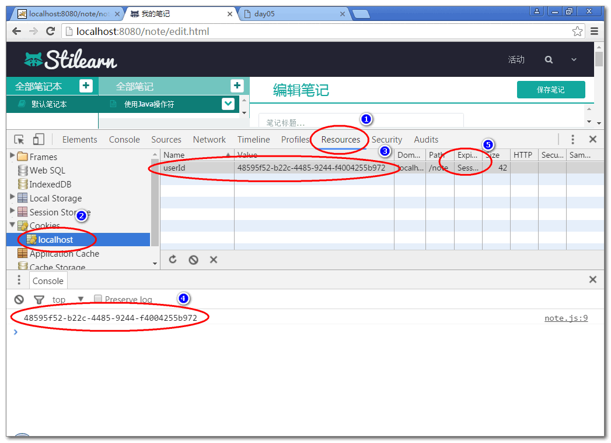

# 云笔记

## 笔记本列表

### 3. 控制器

1. 添加控制器父类AbstractController, 封装公共的异常处理方法:

		public abstract class AbstractController {
			/**
			 * 在其他控制器方法执行出现异常时候, 执行
			 * 异常处理方法 handleException
			 */
			@ExceptionHandler(Exception.class)
			@ResponseBody
			public Object handleException( Exception e){
				e.printStackTrace();
				return new JsonResult(e);
			}
		
		}

	>重构 UserController, 使其继承于 AbstractController

		略...

2. 创建控制器类 NotebookController:

		@RequestMapping("/notebook")
		@Controller
		public class NotebookController extends AbstractController {
			
			@Resource
			private NotebookService notebookService;
			
			@RequestMapping("/list.do")
			@ResponseBody
			public JsonResult list(String userId){
				List<Map<String, Object>> list=
					notebookService.listNotebooks(userId);
				return new JsonResult(list);
			}
		}

3. 测试

		http://localhost:8080/note/notebook/list.do?userId=52f9b276-38ee-447f-a3aa-0d54e7a736e4

		http://localhost:8080/note/notebook/list.do?userId=abc

		http://localhost:8080/note/notebook/list.do

	> 测试结果体现了控制器能够利用父类的异常处理方法处理异常情况.

### 4. 表现层脚本编程

1. 更新log_in.html 引入cookie操作API:

		

2. 更新 login.js 的loginAction方法, 在登录成功时候将userId保存到cookie中:

		...
		//登录成功以后将userId保存到cookie中
		addCookie("userId", user.id); 
		...
	
3. 在edit.html添加JS脚本:

		 
		
		

	> 为了提高页面的用户体验, 减少页面加载延迟, 将脚本在页面后部加载.

4. 添加scripts/note.js 文件:

		var SUCCESS = 0;
		var ERROR = 1;
		
		$(function(){
			
			var userId = getCookie('userId');
			console.log(userId);
			
		});
			
	> scripts/note.js 编码一定是 utf-8 

5. 测试: 登录以后可以再edit.html 的控制台上能够看到 userId, 可以通过浏览器的控制台检查cookie保存情况:

	

6. 在ready函数中调用方法 loadNotebooks() 在页面加载后立即加载笔记本列表数据:

		//网页加载以后, 立即读取笔记本列表
		loadNotebooks();

7. 添加方法loadNotebooks, 利用ajax加载笔记本列表数据:

		/** 加载笔记本列表数据 */
		function loadNotebooks(){
			//利用ajax从服务器获取(get)数据, 使用getJSON方法
			var url = 'notebook/list.do';
			var data = {userId:getCookie('userId'),
					name:'demo'};
			$.getJSON(url, data, function(result){
				console.log(result);
				if(result.state==SUCCESS){
					var notebooks = result.data;
					//在showNotebooks方法中将全部的
					//笔记本数据 notebooks 显示到 
					// notebook-list 区域
					showNotebooks(notebooks);
				}else{
					alert(result.message);
				}
			});
		}
	
	> 提示: 为了保存代码的简洁, 将显示笔记本列表的算法封装到showNotebooks方法中. 

8. 声明showNotebooks方法, 显示在notebook-list区域的ul中显示笔记本列表信息:

		/** 在notebook-list区域中显示笔记本列表 */
		function showNotebooks(notebooks){
			//算法: 
			//找显示笔记本列表的区域的ul元素
			//遍历notebooks数组, 将为每个对象创建一个li
			//元素, 添加到 ul元素中.
			var ul = $('#notebook-list ul');
			ul.empty();//清除ul中原有的内容
			for(var i=0; i<notebooks.length; i++){
				var notebook = notebooks[i];
				var li = notebookTemplate.replace(
						'[name]', notebook.name);
				li = $(li);
				ul.append(li);
			}
		}

		var notebookTemplate = 
			'<li class="online">'+
			'<a><i class="fa fa-book" title="online" '+
			'rel="tooltip-bottom"></i> [name]</a>'+
			'</li>';

	> 提示: notebookTemplate 变量定义了显示笔记本的li元素模板. 来自edit.html页面中.

9. 测试...

## 笔记列表功能

原理:

### 1. 持久层

1. 声明持久层查询方法 NoteDao
		
		public interface NoteDao {
			List<Map<String,Object>> 
				findNotesByNotebookId(
				String notebookId);
		}

2. 声明SQL NoteMapper.xml

		<mapper namespace="cn.tedu.note.dao.NoteDao">
			
			<select id="findNotesByNotebookId"
				parameterType="string"
				resultType="map">
				select 
					cn_note_id as id,
					cn_note_title as title 
				from 
					cn_note
				where
					cn_notebook_id = #{notebookId}
				order by
					cn_note_last_modify_time desc
			</select>
			
		</mapper>
		
3. 测试:

		public class NoteDaoTest  extends BaseTest{
			
			NoteDao dao;
			
			@Before
			public void initDao(){
				dao = ctx.getBean("noteDao",
						NoteDao.class);
			}
			
			@Test
			//select cn_notebook_id from cn_note;
			public void testFindNotesByNotebookId(){
				String id="fa8d3d9d-2de5-4cfe-845f-951041bcc461";
				List<Map<String, Object>> list=
					dao.findNotesByNotebookId(id);
				for (Map<String, Object> map : list) {
					System.out.println(map); 
				}
			}
		}

### 2. 业务层

1. 声明业务层方法 NoteService

		public interface NoteService {
			
			List<Map<String, Object>> listNotes( String notebookId)
				throws NotebookNoteFoundExcepotion;
		
		}

2. 声明业务异常:NotebookNoteFoundExcepotion

		略...

3. 实现业务层方法 NoteServiceImpl

		@Service("noteService")
		public class NoteServiceImpl implements NoteService{
			
			@Resource
			private NoteDao noteDao;
			
			@Resource
			private NotebookDao notebookDao;
			
			public List<Map<String, Object>> listNotes( String notebookId) 
					throws NotebookNoteFoundExcepotion {
				if(notebookId==null || notebookId.trim().isEmpty()){
					throw new NotebookNoteFoundExcepotion("ID为空");
				}
				//Notebook notebook = notebookDao
				//		.findNotebookById(notebookId);
				//if(notebook==null){
				//	throw new NotebookNoteFoundExcepotion("没有笔记本");
				//}
				int n = notebookDao.countNotebookById(
						notebookId);
				if(n!=1){
					throw new NotebookNoteFoundExcepotion("没有笔记本");
				}
				
				return noteDao.findNotesByNotebookId(notebookId);
			}
		}

4. 重构NotebookDao, 添加统计方法 countNotebookById

		int countNotebookById(String notebookId);

5. 添加sql NotebookMapper.xml
	
		<select id="countNotebookById"
			parameterType="string"
			resultType="int">
			select 
				count(*) as cnt		
			from 
				cn_notebook
			where
				cn_notebook_id = #{notebookId}
		</select>
		
6. 测试 NoteServiceTest:

		public class NoteServiceTest  extends BaseTest{
			
			NoteService service;
			
			@Before
			public void initService(){
				service = ctx.getBean("noteService",
						NoteService.class);
			}
			
			@Test
			public void testListNotes(){
				String id="fa8d3d9d-2de5-4cfe-845f-951041bcc461";
				List<Map<String, Object>> list=
					service.listNotes(id);
				for (Map<String, Object> map : list) {
					System.out.println(map); 
				}
			}
		}
			
### 3. 控制器

1. 添加控制器 NoteController

		@Controller
		@RequestMapping("/note")
		public class NoteController extends AbstractController{
		
			 @Resource 
			 private NoteService noteService;
		
			 @RequestMapping("/list.do")
			 @ResponseBody
			 public JsonResult list(String notebookId){
				 List<Map<String, Object>> list= 
				 	noteService.listNotes(notebookId);
				 return new JsonResult(list);
			 }
			 
		}

2. 测试:

		http://localhost:8080/note/note/list.do?notebookId=d0b0727f-a233-4a1f-8600-f49fc1f25bc9

### 4. 表现层脚本

1. 重构edit.html, 设置笔记本列表ID notebook-list

		

2. 在note.js 的ready方法中绑定 笔记本列表点击事件:

		//绑定笔记本列表区域的点击事件
		$('#notebook-list').on(
			'click','.notebook', loadNotes);

	> 提示: 这里利用事件冒泡, 在父元素上绑定点击事件, Jquery提供的on方法可以非常方便区别发生事件的事件源. 
	
	> 重构: 重构notebookTemplate, 为li元素添加 notebook 类:

		var notebookTemplate = 
			'<li class="online notebook">'+
			'<a><i class="fa fa-book" title="online" '+
			'rel="tooltip-bottom"></i> [name]</a>'+
			'</li>';

3. 添加事件处理方法 loadNotes: 

		/** 笔记本项目点击事件处理方法, 加载全部笔记 */
		function loadNotes(){
			var li = $(this);//当前被点击的对象li
			
			//在被点击的笔记本li增加选定效果
			li.parent().find('a').removeClass('checked');
			li.find('a').addClass('checked');
			
			var url = 'note/list.do';

			//li.data('notebookId') 方法可以获取绑定到li
			//元素上的数据notebookId, 这个notebookId在
			//showNotebooks方法中绑定li元素上的!

			var data={notebookId:li.data('notebookId')};
			console.log(data);
			$.getJSON(url, data, function(result){
				if(result.state==SUCCESS){
					var notes = result.data;
					showNotes(notes);
				}else{
					alert(result.message);
				}
			});
		}

	> 提示: 笔记本点击时候的选择效果是后续重构过程中添加的.

	> 重构: 重构showNotebooks方法, 将notebookId绑定li元素上

		...
		for(var i=0; i<notebooks.length; i++){
			var notebook = notebooks[i];
			var li = notebookTemplate.replace(
					'[name]', notebook.name);
			li = $(li);
			//将 notebook.id 绑定到 li
			li.data('notebookId', notebook.id);
			
			ul.append(li);
		}
		...

4. 添加 showNotes 方法显示笔记到笔记列表区域:

		/** 将笔记列表信息显示到屏幕上 */
		function showNotes(notes){
			console.log(notes); 
			//将每个笔记对象显示到屏幕的ul区域
			var ul = $('#note-list ul');
			ul.empty();
			for(var i=0; i<notes.length; i++){
				var note = notes[i];
				var li = noteTemplate.replace(
						'[title]', note.title);
				li = $(li);
				ul.append(li);
			}
		}
		
		var noteTemplate = '<li class="online">'+
			'<a>'+
			'<i class="fa fa-file-text-o" title="online" rel="tooltip-bottom"></i> [title]<button type="button" class="btn btn-default btn-xs btn_position btn_slide_down"><i class="fa fa-chevron-down"></i></button>'+
			'</a>'+
			'
'+
			'<dl>'+
				'<dt><button type="button" class="btn btn-default btn-xs btn_move" title="移动至..."><i class="fa fa-random"></i></button></dt>'+
				'<dt><button type="button" class="btn btn-default btn-xs btn_share" title="分享"><i class="fa fa-sitemap"></i></button></dt>'+
				'<dt><button type="button" class="btn btn-default btn-xs btn_delete" title="删除"><i class="fa fa-times"></i></button></dt>'+
			'</dl>'+
			'
'+
			'</li>';
		

	> 重构: edit.html, 设置笔记列表ID note-list

		

5. 测试...

-----------------------

## 作业

1. 实现笔记本列表功能
2. 实现笔记列表功能

