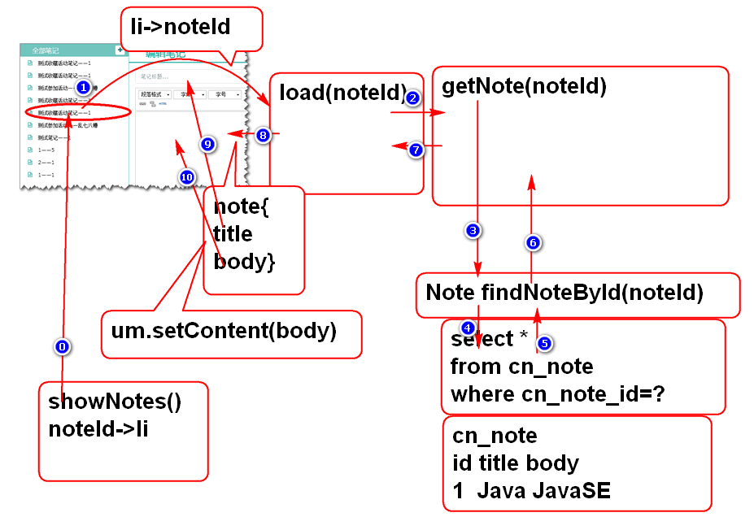
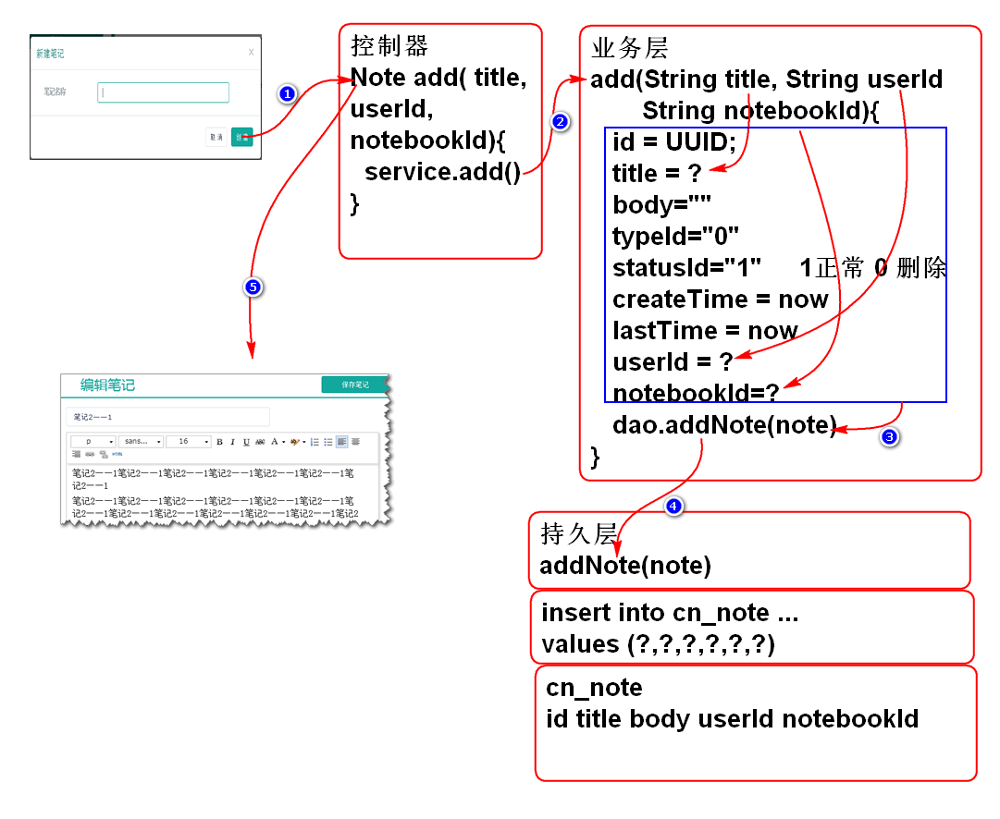
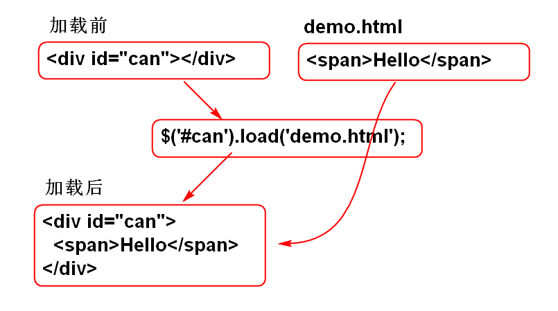
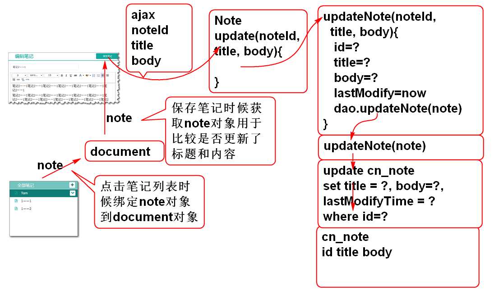

# 云笔记

##　显示笔记功能

原理: 

### 1. 持久层

1. 声明持久层方法 NoteDao
	
		Note findNoteById(String noteId);
	 
2. 声明实体类Note

		public class Note implements Serializable{
			private static final long serialVersionUID = -8176239102696538864L;
		
			private String id;
			private String notebookId;
			private String userId;
			private String statusId;
			private String typeId;
			private String title;
			private String body;
			private Long createTime;
			private Long lastModifyTime;
			
			public Note() {
			}
		
			public Note(String id, String notebookId, String userId, String statusId, String typeId, String title, String body,
					Long createTime, Long lastModifyTime) {
				super();
				this.id = id;
				this.notebookId = notebookId;
				this.userId = userId;
				this.statusId = statusId;
				this.typeId = typeId;
				this.title = title;
				this.body = body;
				this.createTime = createTime;
				this.lastModifyTime = lastModifyTime;
			}
		
			public String getId() {
				return id;
			}
		
			public void setId(String id) {
				this.id = id;
			}
		
			public String getNotebookId() {
				return notebookId;
			}
		
			public void setNotebookId(String notebookId) {
				this.notebookId = notebookId;
			}
		
			public String getUserId() {
				return userId;
			}
		
			public void setUserId(String userId) {
				this.userId = userId;
			}
		
			public String getStatusId() {
				return statusId;
			}
		
			public void setStatusId(String statusId) {
				this.statusId = statusId;
			}
		
			public String getTypeId() {
				return typeId;
			}
		
			public void setTypeId(String typeId) {
				this.typeId = typeId;
			}
		
			public String getTitle() {
				return title;
			}
		
			public void setTitle(String title) {
				this.title = title;
			}
		
			public String getBody() {
				return body;
			}
		
			public void setBody(String body) {
				this.body = body;
			}
		
			public Long getCreateTime() {
				return createTime;
			}
		
			public void setCreateTime(Long createTime) {
				this.createTime = createTime;
			}
		
			public Long getLastModifyTime() {
				return lastModifyTime;
			}
		
			public void setLastModifyTime(Long lastModifyTime) {
				this.lastModifyTime = lastModifyTime;
			}
		
			@Override
			public int hashCode() {
				final int prime = 31;
				int result = 1;
				result = prime * result + ((id == null) ? 0 : id.hashCode());
				return result;
			}
		
			@Override
			public boolean equals(Object obj) {
				if (this == obj)
					return true;
				if (obj == null)
					return false;
				if (getClass() != obj.getClass())
					return false;
				Note other = (Note) obj;
				if (id == null) {
					if (other.id != null)
						return false;
				} else if (!id.equals(other.id))
					return false;
				return true;
			}
		
			@Override
			public String toString() {
				return "Note [id=" + id + ", notebookId=" + notebookId + ", userId=" + userId + ", statusId=" + statusId
						+ ", typeId=" + typeId + ", title=" + title + ", body=" + body + ", createTime=" + createTime
						+ ", lastModifyTime=" + lastModifyTime + "]";
			}
			
		}

3. 声明SQL, NoteMapper.xml

		<select id="findNoteById"
			parameterType="string"
			resultType="cn.tedu.note.entity.Note">
			select
				cn_note_id as id,
				cn_notebook_id as notebookId,
				cn_user_id as userId,
				cn_note_status_id as statusId,
				cn_note_type_id as typeId,
				cn_note_title as title,
				cn_note_body as body,
				cn_note_create_time as createTime,
				cn_note_last_modify_time as lastModifyTime
			from
				cn_note 
			where
				cn_note_id=#{noteId}
		</select>

4. 测试 NoteDaoTest
	
		@Test
		public void testFindNoteById(){
			String noteId = "019cd9e1-b629-4d8d-afd7-2aa9e2d6afe0";
			Note note = dao.findNoteById(noteId);
			System.out.println(note);
		}

### 2. 业务层

1. 声明业务层方法 NoteService

		Note getNote(String noteId)
			throws NoteNotFoundException;

	> 声明业务异常NoteNotFoundException
	
		略...

2. 实现方法 NoteServiceImpl
	
		public Note getNote(String noteId)
				throws NoteNotFoundException {
			if(noteId==null||noteId.trim().isEmpty()){
				throw new NoteNotFoundException("ID空");
			}
			Note note = noteDao.findNoteById(noteId);
			if(note==null){
				throw new NoteNotFoundException("id错误");
			}
			return note;
		}

3. 测试 NoteServiceTest
	
		@Test
		public void testGetNote(){
			String noteId = "019cd9e1-b629-4d8d-afd7-2aa9e2d6afe0";
			Note note = service.getNote(noteId);
			System.out.println(note);
		}

### 3. 控制器

1. 添加控制器方法 NoteController

		@RequestMapping("/load.do")
		@ResponseBody
		public JsonResult load(String noteId) {
			Note note = noteService.getNote(noteId);
			return new JsonResult(note);
		}

2. 测试

	http://localhost:8080/note/note/load.do?noteId=019cd9e1-b629-4d8d-afd7-2aa9e2d6afe0

	http://localhost:8080/note/note/load.do

### 4. 表现层

1. 重构 showNotes 方法, 在显示时候将笔记的ID绑定到LI元素:

		//将笔记ID绑定到li, 用在点击笔记时候显示笔记详细信息
		li.data('noteId', note.id);

2. 重构笔记列表li模板, 在li元素上增加 note 类:

		var noteTemplate = '<li class="online note">'+
			'<a>'+
			'<i class="fa fa-file-text-o" title="online" rel="tooltip-bottom"></i> [title]<button type="button" class="btn btn-default btn-xs btn_position btn_slide_down"><i class="fa fa-chevron-down"></i></button>'+
			'</a>'+
			'
'+
			'<dl>'+
				'<dt><button type="button" class="btn btn-default btn-xs btn_move" title="移动至..."><i class="fa fa-random"></i></button></dt>'+
				'<dt><button type="button" class="btn btn-default btn-xs btn_share" title="分享"><i class="fa fa-sitemap"></i></button></dt>'+
				'<dt><button type="button" class="btn btn-default btn-xs btn_delete" title="删除"><i class="fa fa-times"></i></button></dt>'+
			'</dl>'+
			'
'+
			'</li>';

3. 在ready方法中添加事件监听 笔记列表的点击事件:

		//监听笔记列表中的笔记点击事件,在点击时候加载显示笔记信息
		$('#note-list').on( 'click','.note', loadNote);

4. 添加笔记点击加载笔记的事件处理方法 loadNote

		function loadNote(){
			//获取当前点击的 li 元素
			var li = $(this);
			//获取在显示时候绑定到li中的笔记ID值
			var id = li.data('noteId');
			
			//设置选中高亮效果
			li.parent().find('a').removeClass('checked');
			li.find('a').addClass('checked');
			
			var url = 'note/load.do';
			var data= {noteId: id };
			
			$.getJSON(url, data, function(result){
				//console.log(result);
				if(result.state==SUCCESS){
					var note = result.data;
					showNote(note);
				}else{
					alert(result.message);
				}
			});
		}
	

5. 添加显示笔记信息方法 showNote

		function showNote(note){
			//显示笔记标题
			$('#input_note_title').val(note.title);
			//显示笔记内容
			um.setContent(note.body);
		}

6. 测试 ...

## 新建笔记功能

原理:

### 1. 持久层

1. 声明持久层方法 NoteDao

		int addNote(Note note);

2. 声明SQL, NoteMapper.xml:
	
		<insert id="addNote"
			parameterType="cn.tedu.note.entity.Note">
			insert into cn_note
				(cn_note_id,
				cn_notebook_id, 
				cn_user_id,
				cn_note_status_id,
				cn_note_type_id,
				cn_note_title,
				cn_note_body,
				cn_note_create_time,
				cn_note_last_modify_time)
			values
				(#{id},#{notebookId},#{userId},
				#{statusId},#{typeId},#{title},
				#{body},#{createTime},
				#{lastModifyTime})
		</insert>
		
3. 测试:

		略...

### 2. 业务层

1. 添加业务方法 NoteService
	
		public Note addNote(String userId, 
				String notebookId, String title)
				throws UserNotFoundException,
				NotebookNotFoundException;

	> 提示: 方法的三个参数是根据对业务规程分析来确定的.

2. 实现业务方法 NoteServiceImpl:

		public Note addNote(String userId, 
				String notebookId, String title)
				throws UserNotFoundException, 
				NotebookNotFoundException {
		
			if(userId==null||userId.trim().isEmpty()){
				throw new UserNotFoundException("ID空");
			}
			User user=userDao.findUserById(userId);
			if(user==null){
				throw new UserNotFoundException("木有人");
			}
			if(notebookId==null||notebookId.trim().isEmpty()){
				throw new NotebookNotFoundException("ID空");
			}
			int n=notebookDao.countNotebookById(notebookId);
			if(n!=1){
				throw new NotebookNotFoundException("没有笔记本");
			}
			if(title==null || title.trim().isEmpty()){
				title="葵花宝典";
			}
			String id = UUID.randomUUID().toString();
			String statusId = "0";
			String typeId = "0";
			String body = "";
			long time=System.currentTimeMillis();
			Note note = new Note(id, notebookId,
				userId, statusId, typeId, title, 
				body, time, time);
			n = noteDao.addNote(note);
			if(n!=1){
				throw new NoteNotFoundException("保存失败");
			}
			return note;
		}

3. 测试: NoteServiceTest

		略...

### 3. 控制器

1. 添加控制器方法 NoteController

		@RequestMapping("/add.do")
		@ResponseBody
		public JsonResult add(String userId, String notebookId, String title) {
			Note note = noteService.addNote(userId, notebookId, title);
			return new JsonResult(note);
		}

2. 测试:
		
		http://localhost:8080/note/note/add.do?title=Hello&userId=48595f52-b22c-4485-9244-f4004255b972&notebookId=c8d81ee5-f8cd-49e8-b2e6-ab174a926d95

### 4. 表现层

添加笔记时候 **笔记本ID** 是如何传递的:

1. 在ready方法中绑定事件打开笔记对话框:

		$('#note-list').on('click', '#add_note', showAddNoteDialog);

	> 重构 loadNotes 方法, 在点击笔记本时候将笔记本ID保存起来

	//绑定笔记本ID， 用于添加笔记功能
	$(document).data('notebookId', li.data('notebookId'));

	> 添加显示对话框方法:

		function showAddNoteDialog(){
			var id = $(document).data('notebookId');
			if(id){
				$('#can').load('alert/alert_note.html', function(){
					$('#input_note').focus();
				});
				$('.opacity_bg').show();
				return;
			}
			alert('必须选择笔记本!');
		}

2. 在ready方法中绑定事件关闭笔记对话框:

		$('#can').on('click','.close,.cancel',closeDialog)

	> 添加关闭事件处理方法:

		function closeDialog(){
			$('.opacity_bg').hide();
			$('#can').empty();
		}		

3. 在ready方法中监听对话框中的关闭和取消按钮

		//监听对话框中的关闭和取消按钮
		//其中 '.close,.cancel' 是组选择器器, 表示
		//选择 .close 或 .cancel 按钮
		$('#can').on('click','.close,.cancel',closeDialog)
	
	> 添加关闭事件方法:
		
		function closeDialog(){
			$('.opacity_bg').hide();
			$('#can').empty();
		}

4. 在ready方法中监听新建笔记对话框中的创建笔记按钮

		//监听新建笔记对话框中的创建笔记按钮
		$('#can').on('click','.create-note',addNote);
	
	> 重构: alert/alert_note.html 为 创建笔记 按钮 添加类 create-note
	
		<button type="button" class="btn btn-primary sure create-note">创 建</button>
							
	> 添加创建笔记事件方法

		function addNote(){
			var url = 'note/add.do';
			var notebookId=$(document).data('notebookId');
			var title = $('#can #input_note').val();
		 
			var data = {userId:getCookie('userId'),
				notebookId:notebookId,
				title:title};
			//console.log(data);
			
			$.post(url, data, function(result){
				if(result.state==SUCCESS){
					var note=result.data;
					//console.log(note);
					showNote(note);
					//找到显示笔记列表的ul对象
					var ul = $('#note-list ul');
					//创建新新的笔记列表项目 li 
					var li = noteTemplate.replace(
							'[title]', note.title);
					li = $(li);
					//设置选定效果
					ul.find('a').removeClass('checked');
					li.find('a').addClass('checked');
					//插入到笔记列表的第一个位置
					ul.prepend(li);
					//关闭添加对话框
					closeDialog();   
				}else{
					alert(result.message);
				}
			});
		}

## JQuery 的 load 方法

JQuery提供了异步组件加载方法 load: 

其语法为:

	JQuery.load(url, data, function)

其中:

- 一般在一个JQuery对象使用, 最常见在div对象调用load方法
- url引用一个页面组件, 不是一个完整网页(没有html元素)
- data 是发起请求的 参数.
- function 是页面组件加载后执行的方法.

其工作原理为:

load方法是异步工作的:

> 如果需要页面加载以后执行的代码一定放到 function 中!

	$('#can').load('alert/alert_note.html', 
		function(){console.log("加载完成");
	}); 
	console.log('正在加载');

类比案例:

	$('#can').load('购买饮料', 
		function(){console.log("买回来了!");
	}); 
	console.log('去买饮料了!');

## 保存笔记功能

原理:

### 1. 持久层

1. 定义保存方法 NoteDao

		int updateNote(Note note);
	
2. 添加SQL NoteMapper.xml

		<!-- NoteMapper.xml -->
		<update id="updateNote"
			parameterType="cn.tedu.note.entity.Note">
			update
				cn_note 
			set
				<if test="notebookId!=null">
					cn_notebook_id=#{notebookId},
				</if>
				<if test="userId!=null">
					cn_user_id=#{userId},
				</if>
				<if test="statusId!=null">
					cn_note_status_id=#{statusId},
				</if>
				<if test="typeId!=null">
					cn_note_type_id=#{typeId},
				</if>
				<if test="title!=null">
					cn_note_title=#{title},
				</if>
				<if test="body!=null">
					cn_note_body=#{body},
				</if>
				cn_note_last_modify_time=#{lastModifyTime}
			where 
				cn_note_id=#{id} 
		</update>
	
	> MyBatis 的 if 标签可以动态生成SQL, 这里可以实现部分属性更新功能

3. 测试: NoteDaoTest

		@Test
		public void testUpdateNote(){
			Note note = new Note();
			String noteId = "019cd9e1-b629-4d8d-afd7-2aa9e2d6afe0";
			note.setId(noteId);
			note.setTitle("Test");
			note.setBody("Test123");
			note.setLastModifyTime(System.currentTimeMillis());
			dao.updateNote(note);
			note = dao.findNoteById(noteId);
			System.out.println(note); 
		}
	
### 2. 业务层

1. 业务层方法 NoteService

		boolean update(String noteId, String title, String body)
			throws NoteNotFoundException;

2. 实现业务方法 NoteServiceImpl
	
		public boolean update(String noteId, String title, 
				String body) throws NoteNotFoundException {
			if(noteId==null || noteId.trim().isEmpty()){
				throw new NoteNotFoundException("ID不能空");
			}
			Note note = noteDao.findNoteById(noteId);
			if(note==null){
				throw new NoteNotFoundException("没有对应的笔记");
			} 
			Note data = new Note();
			if(title!=null && !title.equals(note.getTitle())){
				data.setTitle(title);
			}
			if(body!=null && !body.equals(note.getBody())){
				data.setBody(body);
			}
			data.setId(noteId);
			data.setLastModifyTime(System.currentTimeMillis());
			System.out.println(data); 
			int n = noteDao.updateNote(data);
			return n==1;
			 
		}

3. 测试: NoteServiceTest

		@Test
		public void testUpdate(){
			String id = "019cd9e1-b629-4d8d-afd7-2aa9e2d6afe0";
			String title = "Test";
			String body = "今天天气不错";
			boolean b = service.update(id, title, body);
			Note note = service.getNote(id);
			System.out.println(b);
			System.out.println(note);
		}

### 3. 控制器

1. NoteController
	
		@RequestMapping("/update.do")
		@ResponseBody
		public JsonResult update(String noteId, String title, String body) {
			boolean success = noteService.update(noteId, title, body);
			return new JsonResult(success);
		}

### 4. 表现层

1. 重构 showNote 方法
	
		function showNote(note){
			//显示笔记标题
			$('#input_note_title').val(note.title);
			//显示笔记内容
			um.setContent(note.body);
			
			//绑定笔记信息, 用于保存操作
			$(document).data('note', note);
		
		}

2. 在ready方法中绑定 保存 事件

		//绑定点击保存笔记事件
		$('#save_note').on('click', updateNote);

3. 添加事件处理方法

		function updateNote(){
			var url = 'note/update.do';
			var note = $(document).data('note');
			var data = {noteId:note.id};
			var modified = false;
			var title = $('#input_note_title').val();
			if(title && title!=note.title){
				data.title = title;
				modified = true;
			}
			var body = um.getContent();
			if(body && body != note.body ){
				data.body = body;
				modified = true;
			}
			if(modified){
				
				$.post(url, data, function(result){
		
					if(result.state == 0){
						//console.log("Success!");
						//内存中的 note 改成新的数据
						note.title = title;
						note.body = body;
						var l = $('#note-list .checked').parent();
						$('#note-list .checked').remove()
						var li = noteTemplate.replace( '[title]', title);
						var a = $(li).find('a');
						a.addClass('checked');
						l.prepend(a);
					}else{
						alert(result.mesage);
					}
				});
			}
		}

4. 测试

----------

## 作业 

1. 完成添加笔记功能
2. 完成保存笔记功能
3. 完成显示笔记功能