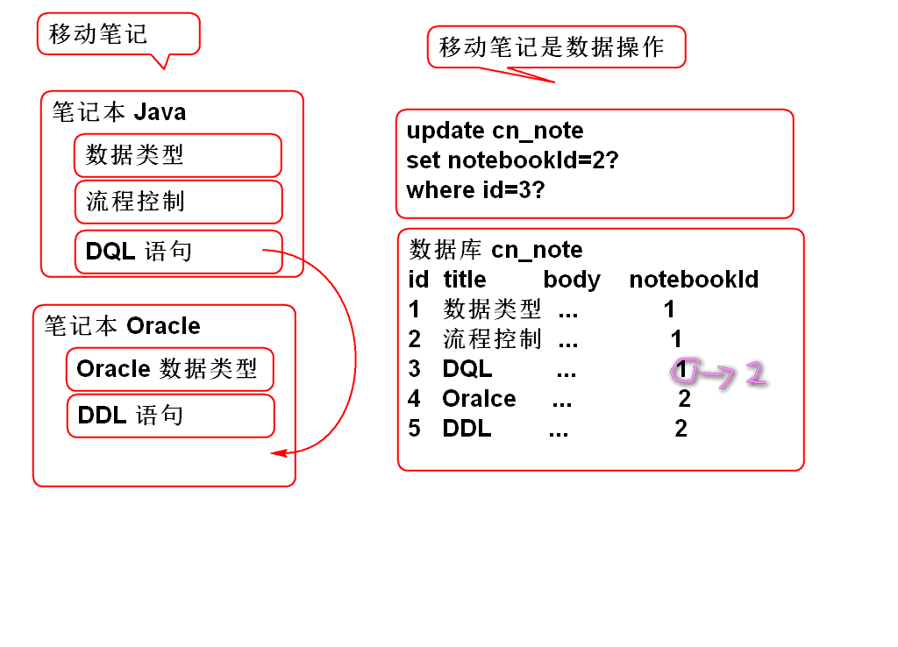

# 云笔记

## 弹出笔记子菜单

### 1. 利用事件冒泡在 note-list 上绑定事件弹出笔记子菜单:

1. 重构笔记列表模板, 为笔记子菜单触发按钮添加类 btn-note-menu

		var noteTemplate = '<li class="online note">'+
			'<a>'+
			'<i class="fa fa-file-text-o" title="online" rel="tooltip-bottom"></i> [title]<button type="button" class="btn btn-default btn-xs btn_position btn_slide_down btn-note-menu"><i class="fa fa-chevron-down"></i></button>'+
			'</a>'+
			'
'+
			'<dl>'+
				'<dt><button type="button" class="btn btn-default btn-xs btn_move" title="移动至..."><i class="fa fa-random"></i></button></dt>'+
				'<dt><button type="button" class="btn btn-default btn-xs btn_share" title="分享"><i class="fa fa-sitemap"></i></button></dt>'+
				'<dt><button type="button" class="btn btn-default btn-xs btn_delete" title="删除"><i class="fa fa-times"></i></button></dt>'+
			'</dl>'+
			'
'+
			'</li>';

2. 在ready方法中绑定 触发事件

		//绑定笔记子菜单的触发事件
		$('#note-list').on('click', 
				'.btn-note-menu', showNoteMenu);

3. 添加事件处理方法

		/** 显示笔记子菜单处理方法 */
		function showNoteMenu(){
			//找到菜单对象, 调用show() 方法
			var btn = $(this);
			//如果当前是被选定的 笔记项目 就弹出子菜单
			btn.parent('.checked').next().toggle();
			//btn.parent('.checked') 获取当前按钮的父元素
			//这个元素必须符合选择器'.checked', 如果不
			//符合就返回空的JQuery元素. 	
			return false;//阻止点击事件的继续传播!避免传播到document对象时候, 触发关闭菜单事件
		}

4. ready方法中绑定document的点击事件, 利用事件冒泡关闭子菜单
	
		//监听整体的文档区域, 任何位置点击都要关闭笔记子菜单
		$(document).click(hideNoteMenu);

5. 添加事件处理方法关闭子菜单
	
		/** 关闭笔记子菜单事件处理方法 */
		function hideNoteMenu(){
			$('.note_menu').hide();
		}

## 移动笔记功能

原理:

### 1. 持久层: 重用 NoteDao.updateNote 方法

	略...

### 2. 业务层

1. 业务层方法 NoteService

		boolean moveNote(String noteId, String notebookId)
				throws NoteNotFoundException,
				NotebookNotFoundException;

2. 实现业务层方法: NoteServiceImpl

		public boolean moveNote(String noteId, String notebookId)
				throws NoteNotFoundException, NotebookNotFoundException {
			if(noteId==null || noteId.trim().isEmpty()){
				throw new NoteNotFoundException("ID不能空");
			}
			Note note = noteDao.findNoteById(noteId);
			if(note==null){
				throw new NoteNotFoundException("没有对应的笔记");
			} 
			if(notebookId==null||notebookId.trim().isEmpty()){
				throw new NotebookNotFoundException("ID空");
			}
			int n=notebookDao.countNotebookById(notebookId);
			if(n!=1){
				throw new NotebookNotFoundException("没有笔记本");
			}
			
			Note data = new Note();
			data.setId(noteId);
			data.setNotebookId(notebookId);
			data.setLastModifyTime(System.currentTimeMillis());
			
			n = noteDao.updateNote(data);
			
			return n==1;
		}

3. 测试

### 3. 表现层

1. 在ready方法中监听移动按钮点击事件打开对话框

		//监听笔记子菜单中移动按钮的点击
		$('#note-list').on('click', '.btn_move', showMoveNoteDialog);

2. 添加事件处理方法, 打开对话框, 打开对话框以后加载笔记本下拉列表

		/** 显示移动笔记对话框 */
		function showMoveNoteDialog(){
			var id = $(document).data('note').id;
			if(id){
				$('#can').load('alert/alert_move.html', loadNotebookOptions);
				$('.opacity_bg').show();
				return;
			}
			alert('必须选择笔记!');
		} 

3. 添加加载笔记本列表事件方法

		/** 加载移动笔记对话框中的笔记本列表 */
		function loadNotebookOptions(){
			var url = 'notebook/list.do';
			var data={userId:getCookie('userId')};
			$.getJSON(url, data, function(result){
				if(result.state==SUCCESS){
					var notebooks = result.data;
					//清楚全部的笔记本下拉列表选项
					//添加新的笔记本列表选项
					$('#moveSelect').empty();
					var id=$(document).data('notebookId');
					for(var i=0; i<notebooks.length; i++){
						var notebook = notebooks[i];
						var opt=$('<option></option>')
							.val(notebook.id)
							.html(notebook.name);
						//默认选定当时笔记的笔记本ID
						if(notebook.id==id){
							opt.attr('selected','selected');
						}
						$('#moveSelect').append(opt);
					}
				}else{
					alert(result.message);
				}
			});
		}

4. 在ready方法中监听 移动笔记对话框中的确定按钮

		//监听移动笔记对话框中的确定按钮
		$('#can').on('click', '.move-note', moveNote);
	
	> 重构 alert_move.html, 在确定按钮上增加 类 move-note

		<button type="button" class="btn btn-primary sure move-note">确 定</button>

5. 添加移动笔记对话框确认事件:

		/** 移动笔记事件处理方法 */
		function moveNote(){
			
			var url = 'note/move.do';
			var id = $(document).data('note').id;
			var bookId=$('#moveSelect').val();
			//笔记本ID没有变化, 就不移动了!
			if(bookId==$(document).data('notebookId')){
				return;
			}
			var data = {noteId:id, notebookId:bookId};
			$.post(url, data, function(result){
				if(result.state==SUCCESS){
					//移动成功, 在当前笔记列表中删除移动的笔记
					//将笔记列表中的第一个设置为当前笔记, 否则清空边编辑区域
					var li = $('#note-list .checked').parent();
					var lis = li.siblings();
					if(lis.size()>0){
						lis.eq(0).click();
					}else{
						$('#input_note_title').val("");
						um.setContent("");
					}
					li.remove();
					closeDialog();//关闭对话框!
				}else{
					alert(result.message);
				}
			});
		}
			
6. 测试

## 删除笔记功能

### 1. 持久层

1. 重用 NoteDao.updateNote 方法.

		略

2. 重构SQL, 笔记本列表中显示没有删除的笔记: NoteMapper.xml

		<select id="findNotesByNotebookId"
			parameterType="string"
			resultType="map">
			select 
				cn_note_id as id,
				cn_note_title as title 
			from 
				cn_note
			where
				cn_notebook_id = #{notebookId} and 
				cn_note_status_id = '1'
			order by
				cn_note_last_modify_time desc
		</select>
	
	> 注意：　增加了查询条件 cn_note_status_id = '1'

### 2. 业务层

1. 添加业务层方法 NoteService

		boolean deleteNote(String noteId)
			throws NoteNotFoundException;

2. 实现业务层方法 NoteServiceImpl

		public boolean deleteNote(String noteId) throws NoteNotFoundException {
			if(noteId==null || noteId.trim().isEmpty()){
				throw new NoteNotFoundException("ID不能空");
			}
			Note note = noteDao.findNoteById(noteId);
			if(note==null){
				throw new NoteNotFoundException("没有对应的笔记");
			} 
			
			Note data = new Note();
			data.setId(noteId);
			data.setStatusId("0");
			data.setLastModifyTime(System.currentTimeMillis());
			
			int n = noteDao.updateNote(data);
			
			return n==1;
		}

3. 测试

		略

### 3. 控制器

1. 添加控制器方法 NoteController

		@RequestMapping("/delete.do")
		@ResponseBody
		public JsonResult delete(String noteId) {
			boolean b = noteService.deleteNote(
					noteId);
			return new JsonResult(b);
		}

2. 测试 

		略

### 4. 表现层

1. 在ready 方法中监听 笔记子菜单中的删除按钮:

		//监听笔记子菜单中删除按钮的点击
		$('#note-list').on('click', '.btn_delete', showDeleteNoteDialog);
	
	> 添加事件处理方法

		/** 打开删除笔记对话框 */
		function showDeleteNoteDialog(){
			var id = $(document).data('note').id;
			if(id){
				$('#can').load('alert/alert_delete_note.html', loadNotebookOptions);
				$('.opacity_bg').show();
				return;
			}
			alert('必须选择笔记!');
		}

2. 在ready中监听删除笔记对话框中的确定按钮事件

	//监听删除笔记对话框中的确定按钮
	$('#can').on('click', '.delete-note', deleteNote);

	> 重构 alert_detete_note.html 在确定按钮上增加 类 delete-note

		<button type="button" class="btn btn-primary sure delete-note">删 除</button>
	
	> 事件监听方法
	
		/** 删除笔记功能 */
		function deleteNote(){
			var url = 'note/delete.do';
			var id = $(document).data('note').id;
			var data = {noteId:id};
			$.post(url, data, function(result){
				if(result.state==SUCCESS){
					//删除成功, 在当前笔记列表中删除笔记
					//将笔记列表中的第一个设置为当前笔记, 否则清空边编辑区域
					var li = $('#note-list .checked').parent();
					var lis = li.siblings();
					if(lis.size()>0){
						lis.eq(0).click();
					}else{
						$('#input_note_title').val("");
						um.setContent("");
					}
					li.remove();
					closeDialog();//关闭对话框!
				}else{
					alert(result.message);
				}
			});
		
		}

3. 测试 

		略...

		
## JS 面向对象编程

### 如何创建JS对象

1. JSON语法声明对象(直接量声明对象)

		var obj = {};

2. 使用 Object 创建对象

		var obj = new Object();

### JS对象可以后期添加属性

案例

	var obj = {};
	obj.name = "Tom";
	
	var obj2 = new Object();
	obj2.name = "Jerry";

对象特点:

1. new Object() 和 JSON 语法创建的对象没有差别!
	- JSON语法简洁方便, 更加容易使用
2. 对象可以随时添加属性
	- 对象.属性 = 值
3. 不存在的属性, 值是 undefined
	- undefined 相当于 false, 利用这个特点可以用于检测属性是否存在

			if(! obj.age){
				console.log('没有age属性');
			}
		
			if(obj.age){
				console.log('年龄:'+obj.age);	
			}
	
4. 可以随时删除对象的属性

		delete 对象.属性;

5. JS Object的底层本质是一个散列表!
	- 为对象添加属性, 本质是添加了 key:value, key是属性名, value是属性值.
	- 访问对象属性, 本质是get(key)
	
> JS对象没有封装性可言! 因为不能完整支持面向对象3大特性, 所有JS不是面向对象的编程语言!

### JS 对象的方法

js对象的方法, 本质是一个属性, 是一个值是函数对象的属性!
	
	var obj = {};
	obj.name = "Tom";
	obj.who = function(){
		console.log(this.name);
	}; 

调用方法与访问属性

	obj.who();//调用方法
	obj.who; 访问属性的值, 函数对象

可以像属性一样删除方法

	delete obj.who

可以像属性一样, 修改方法!
	
	obj.who=function(){
		console.log(this.name);
	};
	obj.who=function(){
		console.log('Hello World!');
	};
	//who方法引用最后一个函数对象

JS方法没有重载!!

	obj.add = function(a, b){
		return a+b;
	}
	obj.add = function(a, b, c){
		return a+b+c;
	}
	//最后只保留最后的方法: add = a+b+c
	obj.add(1,2) //返回未定义
	obj.add(1,2,3) //返回6

### 使用JSON直接声明属性和方法

	var obj = {
		name:'Tom', 
		age:18, 
		who:function(){
			console.log(this.name);
		}
	};
	//后期扩展属性
	obj.price=25;

### 默认的变量和函数

在网页值直接声明的变量和函数, 是window对象的属性和方法

也可以利用赋值, 修改window提供的属性和方法:

	//重写JS原生alert函数
	window.alert=function(e){
		$('#can').load('./alert/alert_error.html',function(){
			$('#error_info').text(' '+e);
			$('.opacity_bg').show();
		});
	}

## 更正

1. 重构 note.js 

	> 更正: 增加 li.data('noteId', note.id) 否则无法再次点击笔记了!

		function addNote(){
			var url = 'note/add.do';
			var notebookId=$(document).data('notebookId');
			var title = $('#input_note').val();
		 
			var data = {userId:getCookie('userId'),
				notebookId:notebookId,
				title:title};
			//console.log(data);
			
			$.post(url, data, function(result){
				if(result.state==SUCCESS){
					var note=result.data;
					//console.log(note);
					showNote(note);
					//找到显示笔记列表的ul对象
					var ul = $('#note-list ul');
					//创建新新的笔记列表项目 li 
					var li = noteTemplate.replace(
							'[title]', note.title);
					li = $(li);
					
					//绑定笔记ID到LI
					li.data('noteId', note.id)
		
					//设置选定效果
					ul.find('a').removeClass('checked');
					li.find('a').addClass('checked');
					//插入到笔记列表的第一个位置
					ul.prepend(li);
					//关闭添加对话框
					closeDialog();   
				}else{
					alert(result.message);
				}
			});
		
		}

2. 更正 NoteServiceImpl

	>  更正: addNote 方法中 String statusId = "1" 否则笔记是删除状态的!
	
		public Note addNote(String userId, 
				String notebookId, String title)
				throws UserNotFoundException, 
				NotebookNotFoundException {
		
			if(userId==null||userId.trim().isEmpty()){
				throw new UserNotFoundException("ID空");
			}
			User user=userDao.findUserById(userId);
			if(user==null){
				throw new UserNotFoundException("木有人");
			}
			if(notebookId==null||notebookId.trim().isEmpty()){
				throw new NotebookNotFoundException("ID空");
			}
			int n=notebookDao.countNotebookById(notebookId);
			if(n!=1){
				throw new NotebookNotFoundException("没有笔记本");
			}
			if(title==null || title.trim().isEmpty()){
				title="葵花宝典";
			}
			String id = UUID.randomUUID().toString();
			String statusId = "1";
			String typeId = "1";
			String body = "";
			long time=System.currentTimeMillis();
			Note note = new Note(id, notebookId,
				userId, statusId, typeId, title, 
				body, time, time);
			n = noteDao.addNote(note);
			if(n!=1){
				throw new NoteNotFoundException("保存失败");
			}
			return note;
		}

---------------

## 作业

1. 完成笔记的移动功能
2. 完成笔记的的删除功能

	

