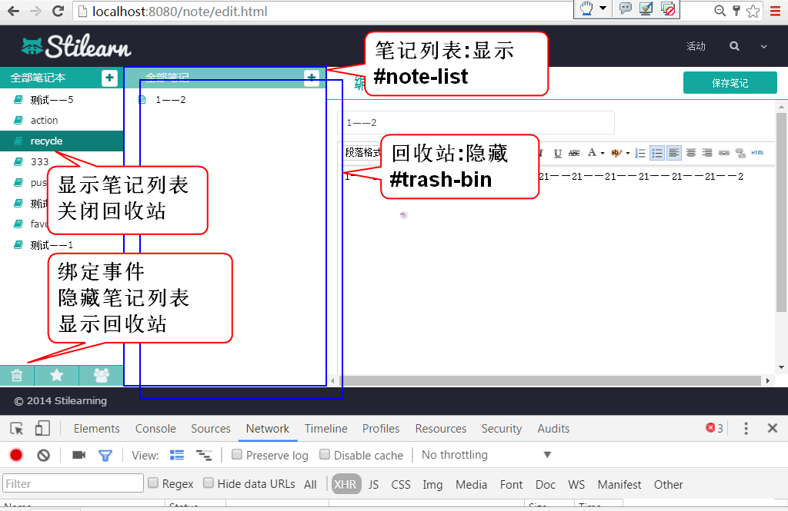

# 云笔记

## 回收站

### 1. 显示回收站

原理:

1. 重构 edit.html 为回收站和回收站按钮设置ID

	> 重构 118 行, 设置 id='trash-bin'

		

	> 重构 81 行, 设置 id='trash_button'

		
<i class='fa fa-trash-o' style='font-size:20px;line-height:31px;'></i>

2. 在ready方法中绑定按钮事件:

		//监听回收站按钮被点击
		$('#trash_button').click(showTrashBin);

	> 添加事件处理方法:

		/** 监听回收站按钮被点击 */
		function showTrashBin(){
			$('#trash-bin').show() ;
			$('#note-list').hide() ;
			//loadTrashBin(); 加载删除笔记列表
		}

### 2. 持久层

1. 添加数据访问方法 NoteDao

		List<Map<String, Object>> findDeleteNotesByUserId(String userId);

2. 添加SQL NoteMapper.xml

		<select id="findDeleteNotesByUserId"
			parameterType="string"
			resultType="map">
			select 
				cn_note_id as id,
				cn_note_title as title 
			from 
				cn_note
			where
				cn_user_id = #{userId} and 
				cn_note_status_id = '0'
			order by
				cn_note_last_modify_time desc
		</select>

3. 测试 

		...

### 3. 业务层

1. 添加业务层方法 NoteService

	List<Map<String, Object>> listNotesInTrashBin(String userId)
			throws UserNotFoundException;

1. 实现业务层方法 NoteServiceImpl

		public List<Map<String, Object>> listNotesInTrashBin(
				String userId) throws UserNotFoundException {
			if(userId==null||userId.trim().isEmpty()){
				throw new UserNotFoundException("ID空");
			}
			User user=userDao.findUserById(userId);
			if(user==null){
				throw new UserNotFoundException("木有人");
			}
			return noteDao.findDeleteNotesByUserId(userId);
		}

3. 测试

		...

### 4. 表现层

1. 添加 loadTrashBin 方法利用Ajax加载回收站笔记列表: 
		
		/** 加载回收站中的笔记列表 */
		function loadTrashBin(){
			var url = 'note/trash.do';
			var data = {userId: getCookie('userId')};
			$.getJSON(url, data, function(result){
				if(result.state==SUCCESS){
					showNotesInTrashBin(result.data);
				}else{
					alert(result.message);
				}
			});
		}

2. 添加显示笔记列表到回收站方法 showNotesInTrashBin

		function showNotesInTrashBin(notes){
			var ul = $('#trash-bin ul');
			ul.empty();
			for(var i=0; i<notes.length; i++){
				var note = notes[i];
				var li = trashBinItem.replace('[title]', note.title);
				li = $(li);
				li.data('noteId', note.id);
				ul.append(li);
			}
		}
		
		var trashBinItem = 
			'<li class="disable">'+
				'<a><i class="fa fa-file-text-o" title="online" rel="tooltip-bottom"></i>'+
				' [title]'+
				'<button type="button" class="btn btn-default btn-xs btn_position btn_delete">'+
					'<i class="fa fa-times"></i>'+
				'</button>'+
				'<button type="button" class="btn btn-default btn-xs btn_position_2 btn_replay">'+
					'<i class="fa fa-reply"></i>'+
				'</button></a>'+
			'</li>';
	
	> 其中 trashBinItem 是回收站笔记项目的模板

3. 重构 showTrashBin 方法, 在显示回收站后加载以删除笔记列表

		/** 监听回收站按钮被点击 */
		function showTrashBin(){
			$('#trash-bin').show() ;
			$('#note-list').hide() ;
			loadTrashBin();// 加载已删除笔记列表
		}

4. 测试

		...

## 恢复删除项目

### 1. 持久层, 重用 NoteDao updateNote 方法

	略

### 2. 业务层

1. 声明业务方法 NoteService

		boolean replayNote(String noteId, String notebookId)
				throws NoteNotFoundException, NotebookNotFoundException;
	
2. 实现业务方法 NoteServiceImpl
	
		public boolean replayNote(String noteId, String notebookId)
				throws NoteNotFoundException, NotebookNotFoundException {
			if(noteId==null || noteId.trim().isEmpty()){
				throw new NoteNotFoundException("ID不能空");
			}
			Note note = noteDao.findNoteById(noteId);
			if(note==null){
				throw new NoteNotFoundException("没有对应的笔记");
			} 
			if(notebookId==null||notebookId.trim().isEmpty()){
				throw new NotebookNotFoundException("ID空");
			}
			int n=notebookDao.countNotebookById(notebookId);
			if(n!=1){
				throw new NotebookNotFoundException("没有笔记本");
			}
			
			Note data = new Note();
			data.setId(noteId);
			data.setStatusId("1");
			data.setNotebookId(notebookId);
			data.setLastModifyTime(System.currentTimeMillis());
			
			n = noteDao.updateNote(data);
			
			return n==1;
		}

3. 测试

		...

### 3. 控制器

1. 添加控制器方法 NoteController

		@RequestMapping("/replay.do")
		@ResponseBody
		public JsonResult replay(String noteId, String notebookId) {
			boolean b = noteService.replayNote(
					noteId, notebookId);
			return new JsonResult(b);
		}
		
2. 测试

		...

### 3. 表现层

1. 在ready方法中添加事件监听方法, 打开恢复对话框:

		//恢复笔记到笔记本按钮事件监听
		$('#trash-bin').on(
			'click', '.btn_replay', showReplayDialog);
	
	> 添加事件方法

		/** 显示恢复笔记对话框 */
		function showReplayDialog(){
			var li = $(this).parent().parent()
			var id = li.data('noteId');
			
			$(document).data('replayItem', li);
			
			if(id){
				$('#can').load('alert/alert_replay.html', loadReplayOptions);
				$('.opacity_bg').show();
				return;
			}
			alert('必须选择笔记!');
		}

	> 提示: 需要在事件中保存 li 到 document中, 在恢复时候需利用这个li获取被恢复的笔记ID

2. 添加方法loadReplayOptions, 在显示窗口以后加载笔记本列表到恢复对话框中:

		function loadReplayOptions(){
			var url = 'notebook/list.do';
			var data={userId:getCookie('userId')};
			$.getJSON(url, data, function(result){
				if(result.state==SUCCESS){
					var notebooks = result.data;
					//清楚全部的笔记本下拉列表选项
					//添加新的笔记本列表选项
					$('#replaySelect').empty();
					var id=$(document).data('notebookId');
					for(var i=0; i<notebooks.length; i++){
						var notebook = notebooks[i];
						var opt=$('<option></option>')
							.val(notebook.id)
							.html(notebook.name);
						//默认选定当时笔记的笔记本ID
						if(notebook.id==id){
							opt.attr('selected','selected');
						}
						$('#replaySelect').append(opt);
					}
				}else{
					alert(result.message);
				}
			});
		
		}

3. 监听恢复对话框中的确定方法:

		$('#can').on('click', '.btn-replay', replayNote);

	> 添加事件处理方法

		function replayNote(){
			var li = $(document).data('replayItem');
			var id = li.data('noteId');
			var url = 'note/replay.do';
			var nid = $('#replaySelect').val();
			var data = {noteId: id, notebookId:nid};
			$.post(url, data, function(result){
				if(result.state==SUCCESS){
					closeDialog();
					li.slideUp(200, function(){$(this).remove()});
				}else{
					alert(result.message);
				}
			});
		}
	
	> 提示: li对象为显示对话框事件中保存到document对象的li.

	> 提示: li.slideUp 方法可以为删除li时候添加动画效果, 这样增加视觉效果可以提高用户的体验.

4. 测试

## 权限检验

原理

### 1. 使用Servlet Filter 检查 html 文件的访问权限

1. 重构 登录控制器, 登录以后将用户信息保存到Session, UserController

		@RequestMapping("/login.do")
		@ResponseBody
		public Object login(
				String name, String password,
				HttpSession session){
			
			User user = userService.login(
				name, password);
			//登录成功时候, 将user信息保存到session
			//用于在过滤器中检查登录情况
			session.setAttribute("loginUser", user); 
			return new JsonResult(user);
		}

2. 添加权限检查过滤器:
	
		public class AccessFilter implements Filter {
		
			public void destroy() {
			}
		
			private String login = "/log_in.html";
			
			public void doFilter(ServletRequest request, ServletResponse response, FilterChain chain) throws IOException, ServletException {
				HttpServletRequest req = 
						(HttpServletRequest)request;
				HttpServletResponse res =
						(HttpServletResponse)response;
				HttpSession session = req.getSession();
				//放过 log_in.html
				String path = req.getRequestURI();
				System.out.println("access:"+path);
				if(path.endsWith(login)){
					chain.doFilter(request, response);
					return;
				}
				//放过  alert_error.html
				if(path.endsWith("alert_error.html")){
					chain.doFilter(request, response);
					return;
				}
				
				//检查用户是否登录
				User user = (User)session
						.getAttribute("loginUser");
				//如果没有登录就重定向到 登录页
				if(user==null){//没有登录
					//重定向到登录页
					res.sendRedirect(
						req.getContextPath()+login);
					return;
				}
				//如果登录就放过
				chain.doFilter(request, response);
			}
		
			public void init(FilterConfig fConfig) throws ServletException {
			}
		
		}
 	
	> 在web.xml 中配置过滤器:

		<filter>
			<display-name>AccessFilter</display-name>
			<filter-name>AccessFilter</filter-name>
			<filter-class>cn.tedu.note.web.AccessFilter</filter-class>
		</filter>
		<filter-mapping>
			<filter-name>AccessFilter</filter-name>
			<url-pattern>*.html</url-pattern>
		</filter-mapping>

3. 测试

### 2. 使用 Spring MVC 拦截器检查 Ajax请求是否登录

1. 添加拦截器Bean

		
		@Component
		public class AccessInterceptor implements 
			HandlerInterceptor {
			public boolean preHandle(
					HttpServletRequest req,
					HttpServletResponse res, 
					Object handle) throws Exception {
				String path=req.getRequestURI();
				System.out.println("Interceptor:"+path);
				HttpSession session = req.getSession();
				User user = (User)session
						.getAttribute("loginUser");
				//如果没有登录就返回错误的JSON消息
				if(user==null){
					JsonResult result = 
						new JsonResult("需要重新登录!");
					//利用response 对象反馈结果
					res.setContentType(
						"application/json;charset=UTF-8");
					res.setCharacterEncoding("UTF-8");
					ObjectMapper mapper = 
							new ObjectMapper();
					String json=mapper
						.writeValueAsString(result);
					res.getWriter().println(json);
					res.flushBuffer();
					return false;
				}
				//如果登录了就放过请求
				return true;//放过请求
			}
			
			public void postHandle(HttpServletRequest arg0, HttpServletResponse arg1, Object arg2, ModelAndView arg3)
					throws Exception {
			}
			
			public void afterCompletion(HttpServletRequest arg0, HttpServletResponse arg1, Object arg2, Exception arg3)
					throws Exception {
			}
		}

2. 配置拦截器 spring-mvc.xml

		<!-- 扫描拦截器组件 -->
		<context:component-scan 
			base-package="cn.tedu.note.web"/>
		<!-- 拦截器bean的ID是accessInterceptor -->
		<!-- 配置拦截器 -->
		<mvc:interceptors>
			<mvc:interceptor>
				<mvc:mapping path="/note/*"/>
				<mvc:mapping path="/notebook/*"/>
				<ref bean="accessInterceptor"/> 
			</mvc:interceptor>
		</mvc:interceptors>	

3. 测试...

### 3. 利用心跳检查, 保持session的活跃

1. 在ready中添加心跳检查方法:

		startHeartbeat();

2. 实现心跳检查方法:

		function startHeartbeat(){
			var url = "user/heartbeat.do";
			setInterval(function(){
				$.getJSON(url, function(result){
					console.log(result.data);
				});
			}, 5000);
		}

3. 添加控制器处理心跳检查 UserController
	
		@RequestMapping("/heartbeat.do")
		@ResponseBody
		public JsonResult heartbeat(){
			Object ok = "ok";
			return new JsonResult(ok);
		}

---------------------

## 作业

1. 完成回收站功能
2. 完成登录权限检查功能

