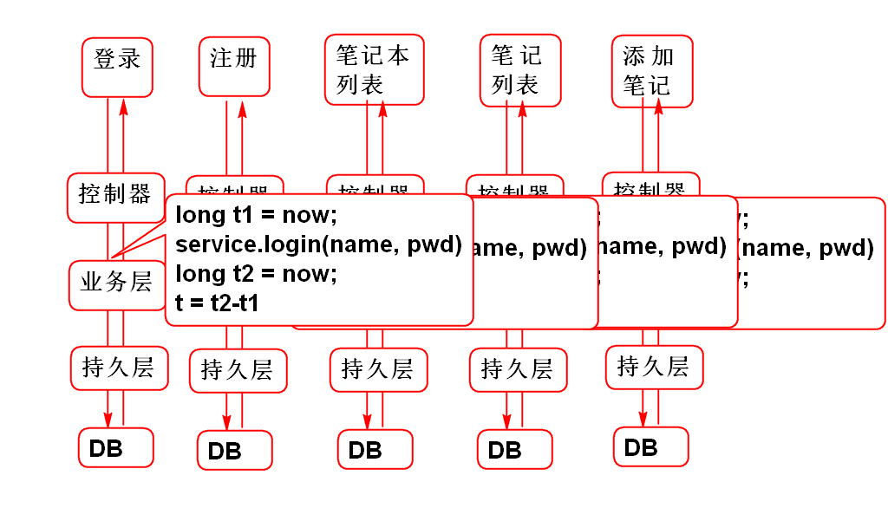
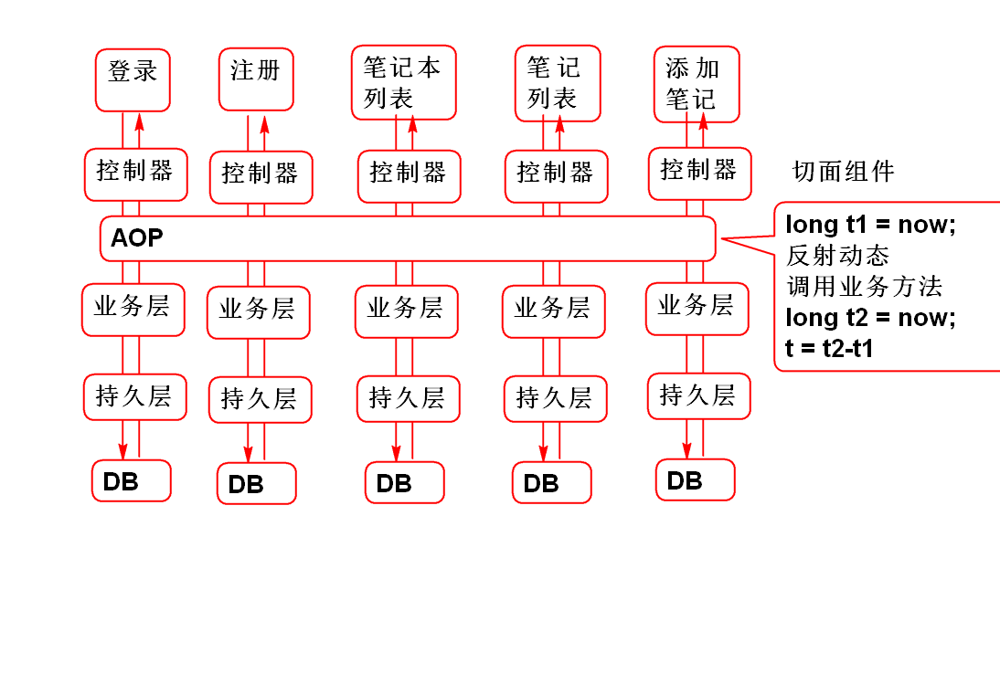
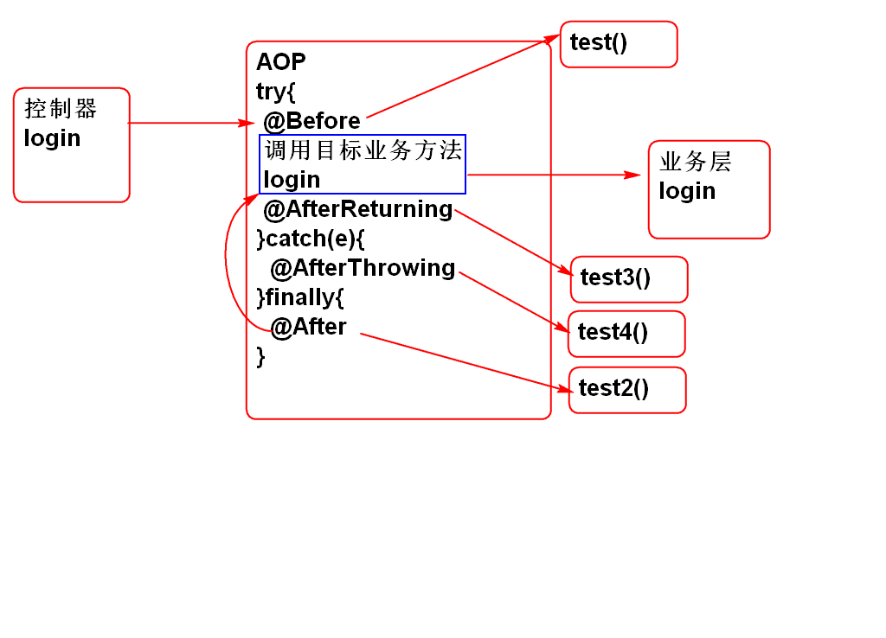
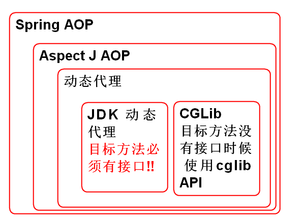
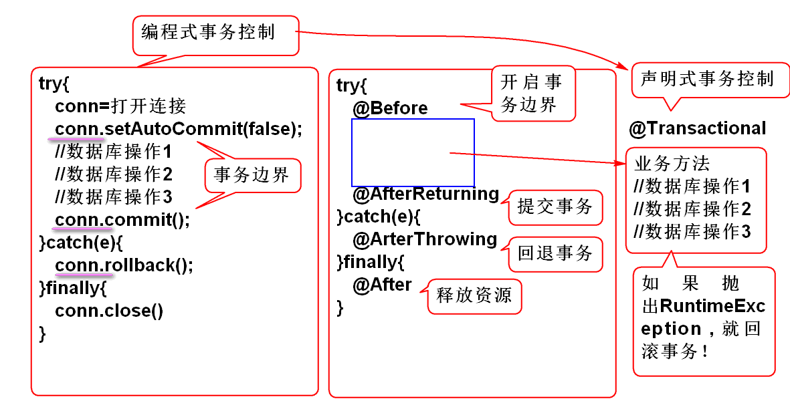

# 云笔记

## AOP 面向切面编程

切面(儿): 事务的横截面

特点: 在不改变软件原有功能情况下为软件插入(扩展)横切面功能.

对于横向功能利用AOP可以大大简化软件的开发:

没有使用AOP:

使用AOP后:

### 开发一个AOP案例:

1. 导入Aspect J 包
	
	> Spring AOP 底层利用了AspectJ实现的!

		<dependency>
		  <groupId>aspectj</groupId>
		  <artifactId>aspectjweaver</artifactId>
		  <version>1.5.3</version>
		</dependency>

2. 创建切面组件

		@Component
		@Aspect 
		public class DemoAspect {
			
			//声明test方法将在 userService的全部方法之前运行
			@Before("bean(userService)")
			public void test(){
				System.out.println("Hello World!");
			}
		}	

3. 配置Spring AOP: spring-aop.xml

		<!-- 配置组件扫描 -->
		<context:component-scan 
			base-package="cn.tedu.note.aop"/>
		<!-- 使 @Aspect 注解生效 -->
		<aop:aspectj-autoproxy/>

4. 测试

		Hello World! 将在userService的业务方法之前执行

### 通知

> 目标方法: 被AOP拦截的业务方法, 称为目标方法

切面方法在执行时机：就在目标方法之前, 之后执行.

- @Before: 切面方法在目标方法之前执行
- @After: 切面方法在目标方法之后执行
- @AfterReturning: 切面方法在目标方法正常结束之后执行
- @AfterThrowing: 切面方法在目标方法异常之后执行

案例:

	/**
	 * 创建一个切面组件, 就是一个普通的JavaBean 
	 */
	@Component
	@Aspect 
	public class DemoAspect {
		
		//声明test方法将在 userService的全部方法之前运行
		@Before("bean(userService)")
		public void test(){
			System.out.println("Hello World!");
		}	
	
		
		@After("bean(userService)")
		public void test2(){
			System.out.println("After");
		}
		
		@AfterReturning("bean(userService)")
		public void test3(){
			System.out.println("AfterReturning");
		}
		
		@AfterThrowing("bean(userService)")
		public void test4(){
			System.out.println("AfterThrowing");
		}
	}
 
### Around 通知

环绕通知, 可以在业务方法前后调用

案例:

	@Component
	@Aspect 
	public class Demo1Aspect {
		
		/**
		 * 环绕通知 方法:
		 * 	1. 必须有返回值值Object
		 *  2. 必须有参数  ProceedingJoinPoint
		 *  3. 必须抛出异常
		 *  4. 需要在方法中调用  jp.proceed()
		 *  5. 返回业务方法的返回值
		 * @param jp
		 * @return 
		 * @throws Throwable
		 */
		@Around("bean(userService)")
		public Object test5(ProceedingJoinPoint jp)
			throws Throwable{
			Object val = jp.proceed();
			System.out.println("业务结果:"+val);
			throw new UserNotFoundException(
					"就是不让登录");
		}
		
	}

### 切入点

用于定位APO的切入位置: 用于指定切入到具体的方法类

- bean组件切入点
	- bean(userService)
	- bean(noteService)
	- bean(userService) || bean(noteService) || bean(notebookService)
	- bean(*Service) 
- 类切入点
	- within(类名)
	- within(类名) || within(类名)
	- within(cn.tedu.note.service.impl.UserServiceImpl)
	- within(cn.tedu.note.*.impl.*ServiceImpl)

- 方法切入点 (execution: 执行)
	- execution(修饰词 类名.方法名(参数类型))
	- execution(* cn.tedu.note.service.UserService.login(..))
	- execution(* cn.tedu.note.*.*Service.list*(..))

> 注意: 一致统一的类和方法的命名规则将有助于编写有效的 切入点表达式!

### AOP 底层原理

代理模式: 不改变原有功能为软件扩展新功能.

AOP封装了动态代理功能, 提供了更加简便的使用方式!

经典面试问题:

	AOP的底层技术是什么? 
	答案: 使用了 动态代理 技术.

关键点:

 
1. Spring AOP 利用了 AspectJ AOP实现的!
2. AspectJ AOP 的底层用了动态代理	
3. 动态代理有两种
	- 目标方法有接口时候自动选用 JDK 动态代理
	- 目标方法没有接口时候选择 CGLib 动态代理

利用异常可以分析AOP调用原理:

	java.lang.NullPointerException
		at cn.tedu.note.service.impl.UserServiceImpl.login(UserServiceImpl.java:34)
		at sun.reflect.NativeMethodAccessorImpl.invoke0(Native Method)
		at sun.reflect.NativeMethodAccessorImpl.invoke(Unknown Source)
		at sun.reflect.DelegatingMethodAccessorImpl.invoke(Unknown Source)
		at java.lang.reflect.Method.invoke(Unknown Source)
		at org.springframework.aop.support.AopUtils.invokeJoinpointUsingReflection(AopUtils.java:317)
		at org.springframework.aop.framework.ReflectiveMethodInvocation.invokeJoinpoint(ReflectiveMethodInvocation.java:183)
		at org.springframework.aop.framework.ReflectiveMethodInvocation.proceed(ReflectiveMethodInvocation.java:150)
		at org.springframework.aop.framework.adapter.MethodBeforeAdviceInterceptor.invoke(MethodBeforeAdviceInterceptor.java:51)
		at org.springframework.aop.framework.ReflectiveMethodInvocation.proceed(ReflectiveMethodInvocation.java:172)
		at org.springframework.aop.interceptor.ExposeInvocationInterceptor.invoke(ExposeInvocationInterceptor.java:91)
		at org.springframework.aop.framework.ReflectiveMethodInvocation.proceed(ReflectiveMethodInvocation.java:172)
		at org.springframework.aop.framework.JdkDynamicAopProxy.invoke(JdkDynamicAopProxy.java:204)
		at com.sun.proxy.$Proxy21.login(Unknown Source)
		at cn.tedu.note.controller.UserController.login(UserController.java:34)
		at sun.reflect.NativeMethodAccessorImpl.invoke0(Native Method)
		at sun.reflect.NativeMethodAccessorImpl.invoke(Unknown Source)
		at sun.reflect.DelegatingMethodAccessorImpl.invoke(Unknown Source)
		at java.lang.reflect.Method.invoke(Unknown Source)
		at org.springframework.web.method.support.InvocableHandlerMethod.invoke(InvocableHandlerMethod.java:215)
		at org.springframework.web.method.support.InvocableHandlerMethod.invokeForRequest(InvocableHandlerMethod.java:132)
		at org.springframework.web.servlet.mvc.method.annotation.ServletInvocableHandlerMethod.invokeAndHandle(ServletInvocableHandlerMethod.java:104)
		at org.springframework.web.servlet.mvc.method.annotation.RequestMappingHandlerAdapter.invokeHandleMethod(RequestMappingHandlerAdapter.java:745)
		at org.springframework.web.servlet.mvc.method.annotation.RequestMappingHandlerAdapter.handleInternal(RequestMappingHandlerAdapter.java:686)
		at org.springframework.web.servlet.mvc.method.AbstractHandlerMethodAdapter.handle(AbstractHandlerMethodAdapter.java:80)
		at org.springframework.web.servlet.DispatcherServlet.doDispatch(DispatcherServlet.java:925)
		at org.springframework.web.servlet.DispatcherServlet.doService(DispatcherServlet.java:856)
		at org.springframework.web.servlet.FrameworkServlet.processRequest(FrameworkServlet.java:953)
		at org.springframework.web.servlet.FrameworkServlet.doPost(FrameworkServlet.java:855)
		at javax.servlet.http.HttpServlet.service(HttpServlet.java:650)
		at org.springframework.web.servlet.FrameworkServlet.service(FrameworkServlet.java:829)
		at javax.servlet.http.HttpServlet.service(HttpServlet.java:731)
		at org.apache.catalina.core.ApplicationFilterChain.internalDoFilter(ApplicationFilterChain.java:303)
		at org.apache.catalina.core.ApplicationFilterChain.doFilter(ApplicationFilterChain.java:208)
		at org.apache.tomcat.websocket.server.WsFilter.doFilter(WsFilter.java:52)
		at org.apache.catalina.core.ApplicationFilterChain.internalDoFilter(ApplicationFilterChain.java:241)
		at org.apache.catalina.core.ApplicationFilterChain.doFilter(ApplicationFilterChain.java:208)
		at cn.tedu.note.web.DemoFilter.doFilter(DemoFilter.java:28)
		at org.apache.catalina.core.ApplicationFilterChain.internalDoFilter(ApplicationFilterChain.java:241)
		at org.apache.catalina.core.ApplicationFilterChain.doFilter(ApplicationFilterChain.java:208)
		at org.apache.catalina.core.StandardWrapperValve.invoke(StandardWrapperValve.java:220)
		at org.apache.catalina.core.StandardContextValve.invoke(StandardContextValve.java:122)
		at org.apache.catalina.authenticator.AuthenticatorBase.invoke(AuthenticatorBase.java:505)
		at org.apache.catalina.core.StandardHostValve.invoke(StandardHostValve.java:169)
		at org.apache.catalina.valves.ErrorReportValve.invoke(ErrorReportValve.java:103)
		at org.apache.catalina.valves.AccessLogValve.invoke(AccessLogValve.java:956)
		at org.apache.catalina.core.StandardEngineValve.invoke(StandardEngineValve.java:116)
		at org.apache.catalina.connector.CoyoteAdapter.service(CoyoteAdapter.java:423)
		at org.apache.coyote.http11.AbstractHttp11Processor.process(AbstractHttp11Processor.java:1079)
		at org.apache.coyote.AbstractProtocol$AbstractConnectionHandler.process(AbstractProtocol.java:625)
		at org.apache.tomcat.util.net.JIoEndpoint$SocketProcessor.run(JIoEndpoint.java:318)
		at java.util.concurrent.ThreadPoolExecutor.runWorker(Unknown Source)
		at java.util.concurrent.ThreadPoolExecutor$Worker.run(Unknown Source)
		at org.apache.tomcat.util.threads.TaskThread$WrappingRunnable.run(TaskThread.java:61)
		at java.lang.Thread.run(Unknown Source)

### AOP 拦截器 过滤器 

1. 过滤器: 拦截处理WEB请求!
2. Spring MVC 拦截器: 拦截处理Spring MVC的请求流程
3. AOP: 拦截Spring中各个组件之间方法请求. 

## 声明式事务处理

### 编程式事务处理

传统编程事务处理非常繁琐:
	
	try{
	   conn=打开连接
	   conn.setAutoCommit(false);
	   //数据库操作1
	   //数据库操作2
	   //数据库操作3
	   conn.commit();
	}catch(e){
	   conn.rollback();
	}finally{
	   conn.close()
	}

### 声明式事务处理

声明式事务处理, 底层是利用AOP实现的, 只需要简单配置即可使用.

### 使用声明式事务处理

1. 配置事务管理器
	
		<!-- spring-mybatis.xml -->
		<bean id="txManager" class="org.springframework.jdbc.datasource.DataSourceTransactionManager">
			<property name="dataSource"
				ref="dataSource"/>
		</bean>
		<!-- 设置 注解驱动的事务管理  -->
		<tx:annotation-driven 
			transaction-manager="txManager"/>

在业务方法上使用 事务注解即可

案例: 批量删除

1. 开发持久层

	> 持久层 NoteDao
		
		int deleteNoteById(String noteId);

	> SQL NoteMapper.xml

		<delete id="deleteNoteById"
			parameterType="string">
			delete from cn_note
			where cn_note_id=#{noteId}	
		</delete> 

2. 业务层
	
	> 业务层接口方法 NoteService

		int deleteNotes(String... noteIds)
			throws NoteNotFoundException;
	
	> 实现业务方法 NoteServiceImpl

		@Transactional
		public int deleteNotes(String... noteIds) 
				throws NoteNotFoundException {
			for(String id: noteIds){
				int n=noteDao.deleteNoteById(id);
				if(n!=1){
					throw new NoteNotFoundException("ID错误"); 
				}
			}
			return noteIds.length;
		}

	> 抛出异常 NoteNotFoundException 时候会触发Spring事务回滚操作.

3. 测试 NoteServerTest

		@Test
		public void testDeleteNotes(){
			String id1 = "3febebb3-a1b7-45ac-83ba-50cdb41e5fc1";
			String id2 = "9187ffd3-4c1e-4768-9f2f-c600e835b823";
			String id3 = "ebd65da6-3f90-45f9-b045-782928a5e2c0";
			String id4 = "A";//"fed920a0-573c-46c8-ae4e-368397846efd";
			
			int n = service.deleteNotes(
				id1, id2, id3, id4);
			//int n = service.deleteNotes(
			//	new String[]{id1, id2, id3, id4});
			System.out.println(n); 
		}

	> 在提交的ID有错误时候会出现异常, 并且回滚数据库事务.

--------------------

## 作业

1. 实现性能测试功能
2. 为业务层增加声明式事务管理

 

