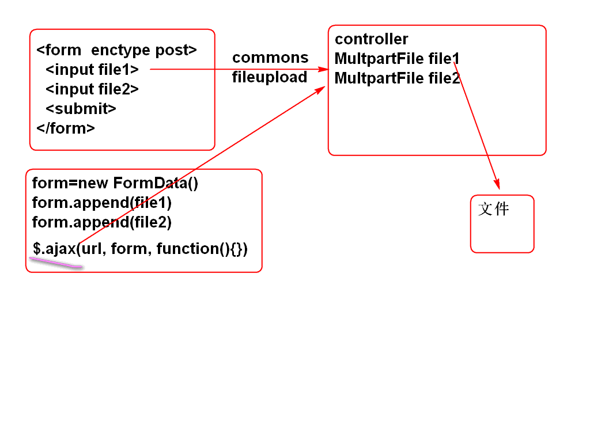
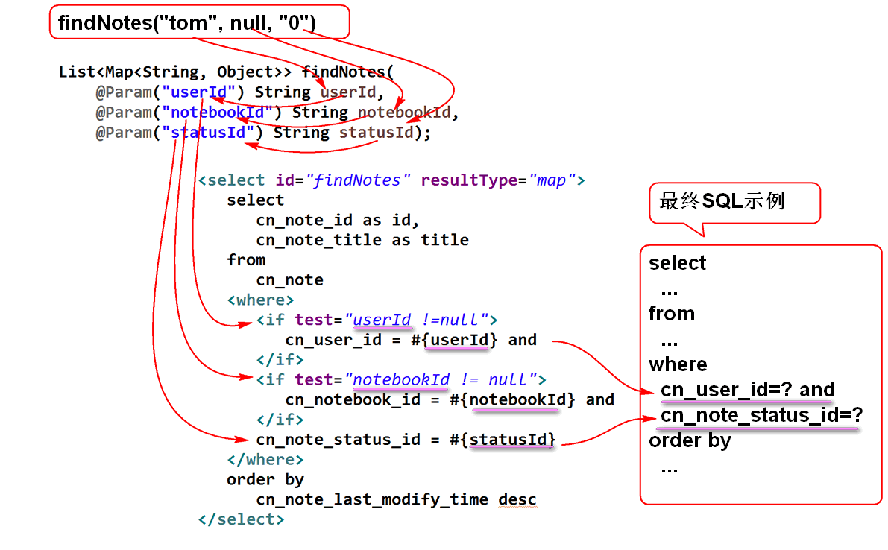
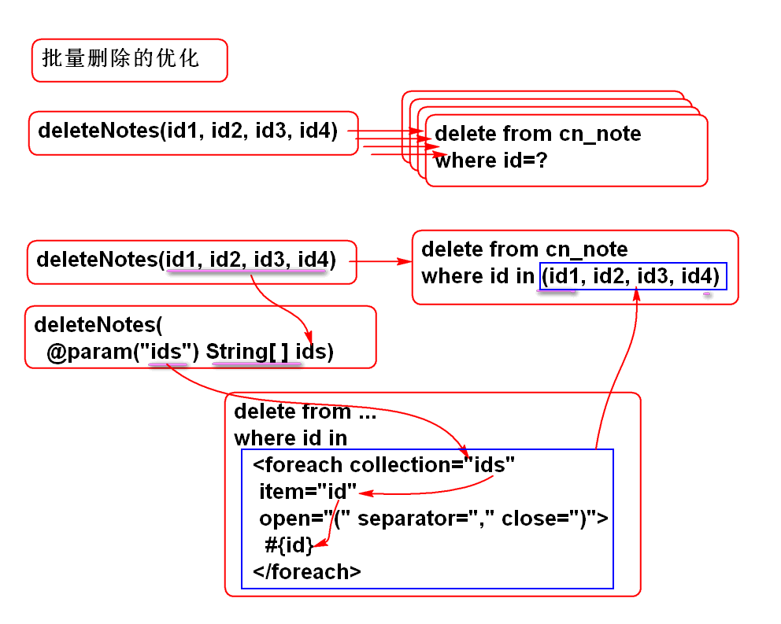
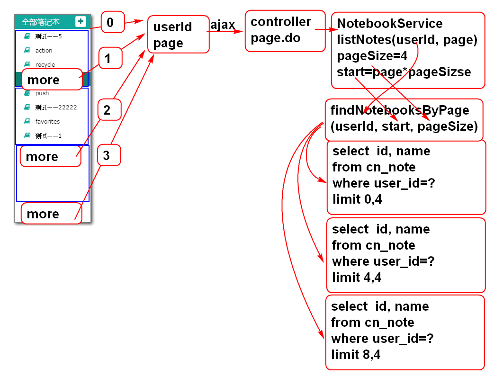
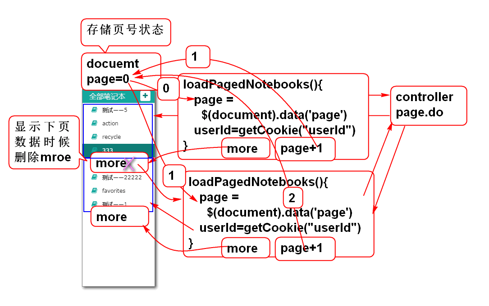
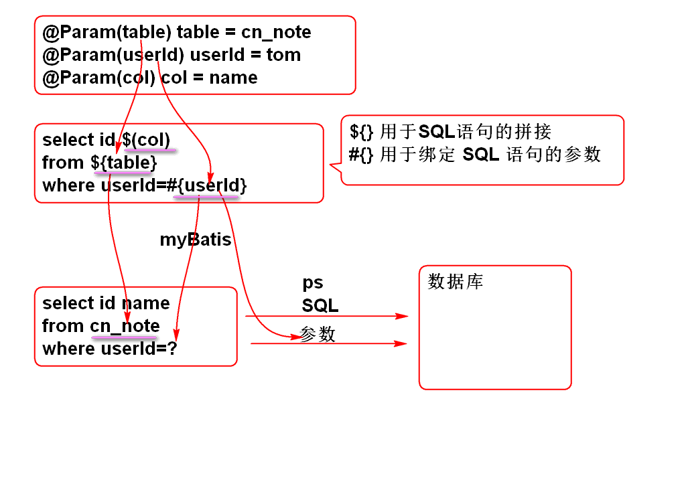
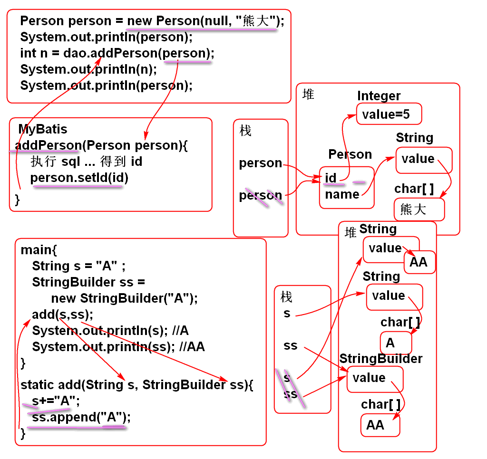

# 云笔记

## 文件上载

### Ajax 文件上载

利用 FormData 对象和 Spring MVC 配合可以实现Ajax文件上载功能:

原理: 

案例:

	<!DOCTYPE html>
	<html>
	<head>
	<meta charset="UTF-8">
	<title>Insert title here</title>
	
	
	</head>
	<body>
		<h1>Ajax 文件上载</h1>
		<input type="file" id="file1">  
		<input type="file" id="file2">  
		<input type="button" id="upload" 
			value="上载" >
		

	</body>
	</html>

> 提示: 服务端重用上节课的案例.

## 多参数查询

在MyBatis中, 利用 @Param 注解, 可以实现多参数查询

原理:

案例:

1. NoteDao接口

		List<Map<String, Object>> findNotes(
			@Param("userId") String userId, 
			@Param("notebookId") String notebookId, 
			@Param("statusId") String statusId);

2. SQL 语句: NoteMapper.xml

		<select id="findNotes" resultType="map">
			select 
				cn_note_id as id,
				cn_note_title as title 
			from 
				cn_note
			<where>
				<if test="userId !=null">
					cn_user_id = #{userId} and
				</if>
				<if test="notebookId != null">
					cn_notebook_id = #{notebookId} and
				</if> 
				cn_note_status_id = #{statusId}
			</where>
			order by
				cn_note_last_modify_time desc
		</select>

## 动态SQL

MyBatis 提供了灵活的动态SQL功能, 只需要使用映射文件的标签就可以到达灵活的拼接SQL语句的功能:

### `<foreach>` 标签的使用

批量删除笔记功能:

原理:

1. 持久层方法 NoteDao

		int deleteNotes(
			@Param("ids") String... ids);

2. 定义SQL NoteMapper.xml
 
		<delete id="deleteNotes">
			delete from cn_note
			where 
				cn_note_id in 
				<foreach collection="ids"
					item="id"
					open="(" separator="," close=")">
					#{id}
				</foreach>
		</delete>
	
3. 测试 NoteDaoTest

		@Test
		public void testDeleteNotes(){
			String id1="07305c91-d9fa-420d-af09-c3ff209608ff";
			String id2="5565bda4-ddee-4f87-844e-2ba83aa4925f";
			String id3="1ec185d6-554a-481b-b322-b562485bb8e8";
			int n = dao.deleteNotes(id1, id2, id3);
			System.out.println(n); 
		}

### trim 和 set 的使用

set标签用于生成 set 子句

trim 标签用于去除多余的 逗号, and 或 or

	<update id="updateNote"
		parameterType="cn.tedu.note.entity.Note">
		update
			cn_note 
		<set>
			<trim suffixOverrides=",">
				<if test="notebookId!=null">
					cn_notebook_id=#{notebookId},
				</if>
				<if test="userId!=null">
					cn_user_id=#{userId},
				</if>
				<if test="statusId!=null">
					cn_note_status_id=#{statusId},
				</if>
				<if test="typeId!=null">
					cn_note_type_id=#{typeId},
				</if>
				<if test="title!=null">
					cn_note_title=#{title},
				</if>
				<if test="body!=null">
					cn_note_body=#{body},
				</if>
				<if test="lastModifyTime != null">
					cn_note_last_modify_time=#{lastModifyTime}
				</if>
			</trim>
		</set>
		where 
			cn_note_id=#{id} 
	</update>

### where 和 trim 标签的使用

where标签用于生成 where 子句

trim 标签用于去除多余的 逗号, and 或 or

	<select id="findNotes" resultType="map">
		select 
			cn_note_id as id,
			cn_note_title as title 
		from 
			cn_note
		<where>
			<trim suffixOverrides="and"> 
				<if test="userId !=null">
					cn_user_id = #{userId} and
				</if>
				<if test="notebookId != null">
					cn_notebook_id = #{notebookId} and
				</if> 
				<if test="statusId!=null">
					cn_note_status_id = #{statusId}
				</if>
			</trim>
		</where>
		order by
			cn_note_last_modify_time desc
	</select>

## 翻页功能

翻页公用与其他业务功能的设计是一样的:

实现步骤

### 服务端

1. 持久层接口 NotebookDao

		List<Map<String, Object>> findNotebooksByPage(
			@Param("userId") String userId,
			@Param("start") int start,
			@Param("pageSize") int pageSize,
			@Param("table") String table);

2. SQL 定义 NotebookMapper.xml

		<select id="findNotebooksByPage"
			resultType="map">
			select 
				cn_notebook_id as id,
				cn_notebook_name as name 
			from 
				${table} 
			where
				cn_user_id = #{userId}
			order by
				cn_notebook_createtime desc
			limit #{start}, #{pageSize}
		</select>

	> ${table} 可以替换SQL语句的表名, 实现动态SQL拼接查询, 尽量不要用于参数部分, 否则可能有SQL注入风险.
	
	> limit 子句是MySQL专用的, 其他数据库不支持.

3. 业务层接口 NotebookService

		List<Map<String, Object>>listNotebooks(
				String userId, Integer page)
				throws UserNotFoundException;

4. 实现业务层方法 NotebookServiceImpl

		@Value("#{jdbc.pageSize}")
		private int pageSize;
	
		public List<Map<String, Object>> 
			listNotebooks(
			String userId, Integer page) 
			throws UserNotFoundException {
			if(userId==null || userId.trim().isEmpty()){
				throw new UserNotFoundException("ID不能空");
			}
			User user = userDao.findUserById(userId);
			if(user==null){
				throw new UserNotFoundException("用户不存在");
			}
			if(page==null){
				page = 0;
			}
			int start = page * pageSize;
			String table = "cn_notebook";
			return notebookDao.findNotebooksByPage(
					userId, start, pageSize, table);
		}

	> 变量table用于动态设置SQL查询的表名

5. 在配置文件中证据页面大小参数 jdbc.properties

		pageSize=4

6. 测试 NotebookServiceTest

		@Test
		public void testAddStars(){
			String userId="03590914-a934-4da9-ba4d-b41799f917d1";
			boolean b = service.addStars(userId, 5);
			System.out.println(b);
			b = service.addStars(userId, 6);
			System.out.println(b);
		}
	
7. 控制器 NotebookController
	
		@RequestMapping("/page.do")
		@ResponseBody
		public JsonResult page(String userId, 
				Integer page){
			List<Map<String, Object>> list=
				notebookService.listNotebooks(
				userId, page);
			return new JsonResult(list);
		}

### 客户端

原理:

1. 重构ready方法:

		//在document对象中存翻页页号状态
		$(document).data('page',0);
		
		//加载第一页数据
		loadPagedNotebooks();
		
		//点击more时候加载下一页数据
		$('#notebook-list').on(
				'click','.more', loadPagedNotebooks);

2. 添加事件处理方法

		function loadPagedNotebooks(){
			var page = $(document).data('page');
			var userId = getCookie('userId');
			//从服务器拉去数据
			var url = 'notebook/page.do';
			var data = {userId: userId, page:page};
			$.getJSON(url, data, function(result){
				if(result.state==SUCCESS){
					var notebooks = result.data;
					showPagedNotebooks(notebooks, page);
					$(document).data('page', page+1);
				}else{
					alert(result.message);
				}
			});
		}
		
3. 添加 分页显示笔记本列表方法:

		function showPagedNotebooks(notebooks, page){
			var ul = $('#notebook-list ul');
			if(page==0){//第一页时候清空 ul中的li
				ul.empty();
			}else{//不是第一页, 只删除.more元素
				ul.find('.more').remove();
			}
			for(var i=0; i<notebooks.length; i++){
				var notebook=notebooks[i];
				var li = notebookTemplate.replace(
						'[name]', notebook.name);
				li = $(li);
				li.data('notebookId', notebook.id);
				ul.append(li);
			}
			if(notebooks.length!=0){
				ul.append(moreTemplate);
			}
		}
		var moreTemplate = 
			'<li class="online more">'+
			'<a><i class="fa fa-plus" title="online" '+
			'rel="tooltip-bottom"></i> 加载更多...</a>'+
			'</li>';

4. 测试 ...

## ${} 与 #{} 

在MyBatis中 

- ${} 用于进行动态SQL拼接, 仅仅是拼接SQL语句, 有SQL注入风险, 不要将用户输入的 参数 利用 ${} 进行拼接
- #{} 用于绑定SQL语句的参数, 也就是生成参数 ?, 然后利用PS执行带参数的SQL

## MyBatis返回自增类型的ID

MyBatis可以返回自动增加的ID:

1. SQL:
	
		create table p_person(
		    id int not null AUTO_INCREMENT,
		    name varchar(100),
		    primary key(id)
		);
		
		insert into p_person (name) values ('李老师');
		insert into p_person (id, name) values (null,'李老师');

	>id  AUTO_INCREMENT 就是MySQL的自增类型

2. 实体:

		public class Person implements Serializable {
			private static final long serialVersionUID = -2365398342302306276L;
		
			private Integer id;
			
			private String name;
			
			public Person() {
			}
		
			public Person(Integer id, String name) {
				super();
				this.id = id;
				this.name = name;
			}
		
			public Integer getId() {
				return id;
			}
		
			public void setId(Integer id) {
				this.id = id;
			}
		
			public String getName() {
				return name;
			}
		
			public void setName(String name) {
				this.name = name;
			}
		
			@Override
			public String toString() {
				return "Person [id=" + id + ", name=" + name + "]";
			}
		
			@Override
			public int hashCode() {
				final int prime = 31;
				int result = 1;
				result = prime * result + ((id == null) ? 0 : id.hashCode());
				return result;
			}
		
			@Override
			public boolean equals(Object obj) {
				if (this == obj)
					return true;
				if (obj == null)
					return false;
				if (getClass() != obj.getClass())
					return false;
				Person other = (Person) obj;
				if (id == null) {
					if (other.id != null)
						return false;
				} else if (!id.equals(other.id))
					return false;
				return true;
			}
			
		}

3. PersonMapper.xml

		<mapper namespace="cn.tedu.note.dao.PersonDao">
			<!-- 在插入时候读取自动生成的ID
			打开useGeneratedKeys="true" 可以读取自增ID
			设置 keyProperty="id" 告诉MyBatis将读取结果
			赋值给 参数 person对象的 id 属性 -->
			<insert id="addPerson"
				parameterType="cn.tedu.note.entity.Person"
				useGeneratedKeys="true"
				keyProperty="id"> 
				insert into p_person(
					id,
					name
				)values(
					null,
					#{name}
				)
			</insert>
			
		</mapper>

4. 测试:
	
	public class PersonDaoTest extends BaseTest {
		
		PersonDao dao;
		
		@Before
		public void initDao(){
			dao = ctx.getBean(
				"personDao", PersonDao.class);
		}
		
		@Test
		public void testAddPerson(){
			Person person = new Person(null, "熊大");
			System.out.println(person);
			int n = dao.addPerson(person);
			System.out.println(n);
			System.out.println(person);
		}
	}

ID赋值原理:

练习:

	public class Demo01 {
		public static void main(String[] args) {
			int n = 2;
			final int[] ary = {2};
			test(n, ary);
			System.out.println(n); //2
			System.out.println(ary[0]); //3
		}
		public static void test(
				Integer i, int[] ary){
			i = i++;
			ary[0]++;
		}
	}

----------------------

## 作业

1. 完成云笔记列表翻页功能
2. 实现自增ID功能
3. 实现Ajax文件上载功能

